# Implémentation d'un réseau de neurones pour la reconnaissance de chiffres manuscrits

Theoretical introduction

1. Statistical inference and the MNIST problem  
2. Introduction to neural networks  
3. Computing the cost function's gradient with backpropagation  
4. Generalization to automatic differentiation  
5. Gradient descent  
6. Steps for implementation

# Statistical inference and the MNIST problem

Statistical inference is the process of inferring properties of a probability distribution by analysing some of its samples.

- Nowadays, machine learning techniques are widely used to solve those problems, and especially neural networks.  
These techniques typically work in two phases:

1. The training phase consists in analysing some given samples to understand their characteristics.  
2. The prediction (or inference) phase consists in making predictions about new and unseen examples from what we have learned previously.

- In this project, we are thus interested in a subset of predictive AI, which is to be differentiated from generative AI.

We'll start with a very simple linear regression example:

- We want to predict a person's weight given their height...  
... and assume the correlation between the two is linear.  
- We will use a training dataset  $\{(x_i, y_i)\}_{i=1}^n$  to fine-tune a mathematical model for future predictions.

$$
\underbrace {y} _ {\text {p r e d i c t i o n}} = \underbrace {a} _ {\text {p a r a m e t e r}} \cdot \underbrace {x} _ {\text {i n p u t}} + \underbrace {b} _ {\text {p a r a m e t e r}} \tag {1}
$$

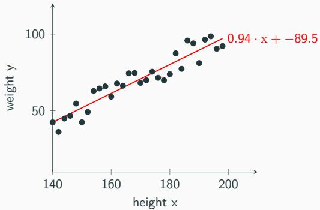  
Figure 1: Linear regression on the height/weight example

- To tune our model, we minimize the cost, defined as the sum of squared residuals:

$$
c = \sum_ {i = 1} ^ {n} \left(a. x _ {i} + b - y _ {i}\right) ^ {2} \tag {2}
$$

$\rightarrow$  This example is very simple and can be solved analytically using the least square method.

# Introduction to the MNIST problem

- The MNIST dataset (Modified National Institute of Standards and Technology) consists of thousands of labeled  $28 \times 28$  grayscale images representing handwritten digits.  
- The goal of this project is to develop a program that classifies those digits in 10 categories. This will also consist in tuning a mathematical model, albeit more complex.

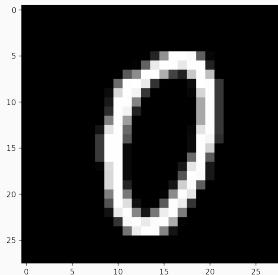  
Figure 2: Input (28x28 image) and output (column vector of size 10) of the MNIST problem

$$
y ^ {p r e d} = \left( \begin{array}{c} 1 \\ 0 \\ 0 \\ \vdots \\ 0 \end{array} \right)
$$

# Introduction to neural networks

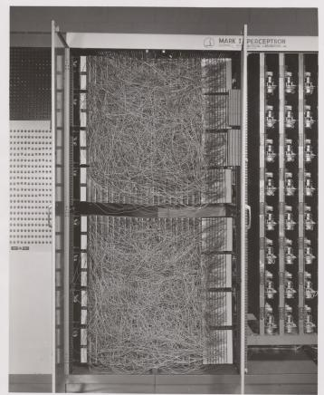  
Figure 3: The Mark I Perceptron computer, an hardware implementation of the perceptron algorithm. (Source: Cornell University Library)

We will solve MNIST using neural networks (NN), which are combinations of individual neurons.

- The concept of the multilayer perceptron, which is the NN model we are going to implement actually dates back to the 50s.  
- Back then, it was known as the perceptron algorithm, and was implemented in hardware by the Mark I Perceptron computer which was already used for image classification.

The concept of neurons takes its inspiration directly from biological neurons, where multiple output are combined to generate a single output:

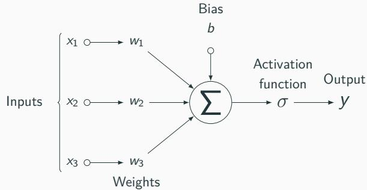  
Figure 4: Representation of a neuron, the elementary unit of neural networks

Formally, a neuron is defined by the following function:

$$
f: \left\{\begin{array}{l}\mathbb {R} ^ {n} \rightarrow [ 0, 1 ]\\x \mapsto \sigma \left(\sum_ {i = 1} ^ {n} x _ {i} w _ {i} + b\right)\end{array}\right. \tag {3}
$$

...which returns an activation value.

# Structure of a multilayer perceptron (MLP)

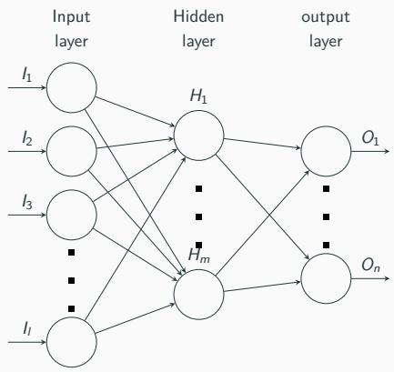  
Figure 5: Structure of a multilayer perceptron, the most basic neural network architecture

- The multilayer perceptron is the simplest form of NN, made of one or multiple densely connected layers (all inputs connected to all outputs).  
Usually, consecutive layers become smaller and smaller as to "abstract" features of the original image.  
- The size of the input layer is the size of the image, while the size of the output layer is the number of categories.

The value of a neuron  $i$  in a layer  $H$  is :

$$
H _ {i} = \sigma \left(\sum_ {j = 1} ^ {I} I _ {j} w _ {j, i} + b _ {i}\right) \tag {4}
$$

Instead of considering each neuron individually, we notice that:

$$
H = \sigma \left(\left[ \begin{array}{c c c c} w _ {1, 1} & w _ {1, 2} & \dots & w _ {1, l} \\ w _ {2, 1} & w _ {2, 2} & \dots & w _ {2, l} \\ \vdots & \vdots & \ddots & \vdots \\ w _ {m, 1} & w _ {m, 2} & \dots & w _ {m, l} \end{array} \right] \cdot \left[ \begin{array}{l} I _ {1} \\ I _ {2} \\ \vdots \\ I _ {l} \end{array} \right] + \left[ \begin{array}{l} b _ {1} \\ b _ {2} \\ \vdots \\ b _ {m} \end{array} \right]\right) \tag {5}
$$

As in the linear regression example, we try to minimize the model's cost (compared to the optimal solution  $\hat{y}$ ). It can first be defined as a vector:

$$
\vec {c} = \left( \begin{array}{c} \left(\hat {y} _ {1} - y _ {1} ^ {\text {p r e d}}\right) ^ {2} \\ \left(\hat {y} _ {2} - y _ {2} ^ {\text {p r e d}}\right) ^ {2} \\ \vdots \\ \left(\hat {y} _ {n} - y _ {n} ^ {\text {p r e d}}\right) ^ {2} \end{array} \right) \tag {6}
$$

... and then as a scalar :

$$
c = \sum_ {i = 1} ^ {n} c _ {i} = \sum_ {i = 1} ^ {n} \left(\hat {y} _ {i} - y _ {i} ^ {\text {p r e d}}\right) ^ {2} \tag {7}
$$

Computing each layer's output then the cost vector's norm yields the network's cost function.

# Computing the cost function's gradient with backpropagation

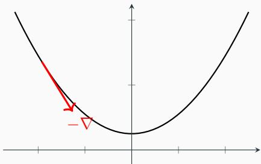  
Figure 6: Intuitive representation of the gradient vector

- As in the least square method, we'll use the cost function's gradient to search for a minimum.  
The gradient of a function  $f(x_{1},\ldots ,x_{n})$  is defined as:

$$
\nabla f = \left[ \begin{array}{c} \frac {\partial f}{\partial x _ {1}} \\ \frac {\partial f}{\partial x _ {2}} \\ \vdots \\ \frac {\partial f}{\partial x _ {n}} \end{array} \right] \tag {8}
$$

It is basically a vector that points us to a minimum of the cost function. Optimization is done by adjusting parameters according to it.

- Finding the expression of the cost function's partial derivatives is only possible with simple models.  
- Because neural networks can become extremely complex (easily thousands of parameters), we can hardly express the partial derivatives through symbolic differentiation.  
- We will give up on finding the gradient's expression and compute it on the fly for each point we examine in a step called backpropagation.

The backpropagation (or backward pass) does not express a gradient, but only computes it for a given point.

It relies on the chain rule :

$$
(f \circ g) ^ {\prime} = \left(f ^ {\prime} \circ g\right). g ^ {\prime} \tag {9}
$$

which can be written as:

$$
\frac {\mathrm {d} \mathbf {z}}{\mathrm {d} \mathbf {x}} = \frac {\mathrm {d} \mathbf {z}}{\mathrm {d} \mathbf {y}} \cdot \frac {\mathrm {d} \mathbf {y}}{\mathrm {d} \mathbf {x}} \tag {10}
$$

...where  $y = g(x)$  and  $z = f(y) = f(g(x))$ .

The idea is to express a complex function as a combination of "elementary operations". An elementary operation is any function for which partial derivatives are known, such as:

- additions +, subtractions -, multiplications  $\times$ , divisions  $\div$  
- trigonometric functions such as  $\cos, \sin, \tan, \text{etc.}$  
and any other "trivial" functions (e, log,...)

Such a decomposition yields a computation graph. Using the chain rule, it is possible to compute the partial derivatives of each intermediate node until the end of the graph, which will give us the partial derivatives (ie. the gradient) of the entire function!

Problem: if an elementary operation has multiple inputs, they all need to be accounted for when computing its partial derivative with regard to  $x$  using the chain rule. This is because all those inputs may depend on  $x$  themselves.

This leads to the following generalization:

$$
\frac {\partial x}{\partial z} = \sum_ {i = 1} ^ {n} \frac {\partial y _ {i}}{\partial z} \cdot \frac {\partial x}{\partial y _ {i}} \tag {11}
$$

...where  $z$  depends on a set  $\{y_{i}\}_{i = 1}^{n}$  of variables, each of them depending on  $x$ .

Let us first introduce gradient computation in forward mode. We have the function

$$
f: \left\{\begin{array}{l}\mathbb {R} ^ {2} \rightarrow \mathbb {R}\\\left(x _ {1}, x _ {2}\right) \mapsto x _ {2}. c o s \left(x _ {1}\right) + e ^ {x _ {2}}\end{array}\right. \tag {12}
$$

With denoting partial derivatives, the computation graph is:

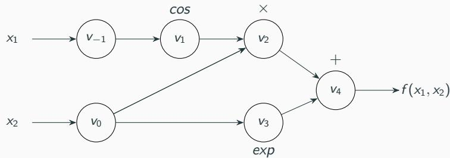  
Figure 7: Base computation graph of  $f$

The partial derivatives will be computed left-to-right by resolving the nodes' dependencies:

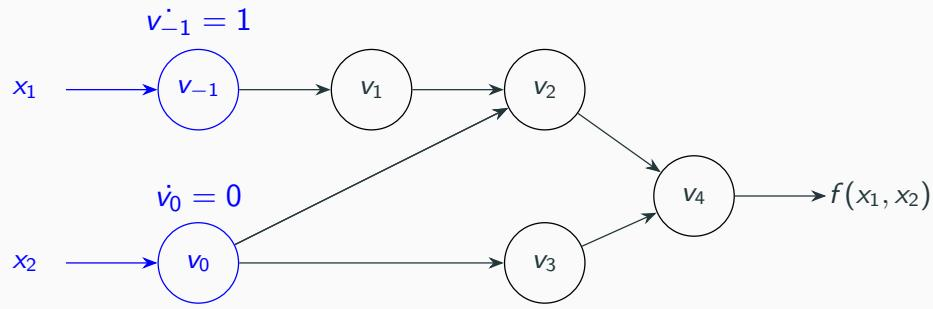  
Figure 8: Detailed chain rule in forward mode for  $f$ , with regard to  $x_{1}$

The partial derivatives will be computed left-to-right by resolving the nodes' dependencies:

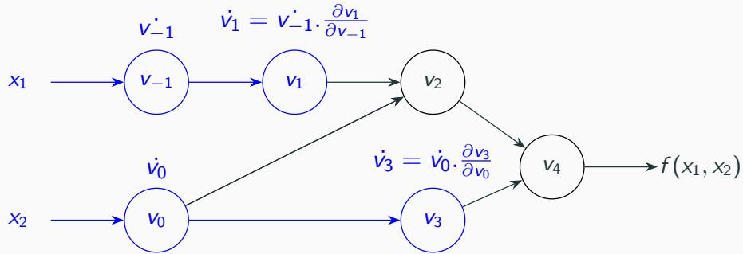  
Figure 8: Detailed chain rule in forward mode for  $f$ , with regard to  $x_{1}$

The partial derivatives will be computed left-to-right by resolving the nodes' dependencies:

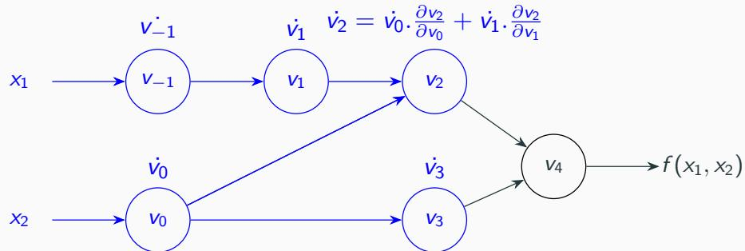  
Figure 8: Detailed chain rule in forward mode for  $f$ , with regard to  $x_{1}$

The partial derivatives will be computed left-to-right by resolving the nodes' dependencies:

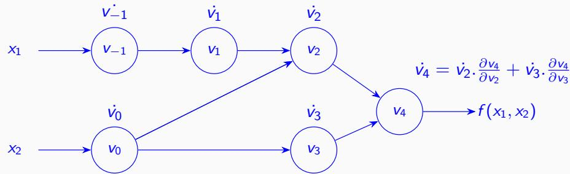  
Figure 8: Detailed chain rule in forward mode for  $f$ , with regard to  $x_{1}$

$$
\left\{ \begin{array}{l} f (\pi , 1) = 1. \cos (\pi) + e ^ {1} = e - 1 \\ \frac {\partial f}{\partial x _ {1}} = - 1. \sin (\pi) = 0 \\ \frac {\partial f}{\partial x _ {2}} = \cos (\pi) + e ^ {1} = e - 1 \end{array} \right. \tag {13}
$$

Table 1: Step-by-step computation of  $\partial f$  in forward mode  

<table><tr><td>Evaluation of f</td><td>Evaluation of ∂f/∂x1</td><td>Evaluation of ∂f/∂x2</td></tr><tr><td>v-1=x1=π</td><td>v&#x27;-1=x1=1</td><td>v&#x27;-1=x1=0</td></tr><tr><td>v0=x2=1</td><td>v0=x2=0</td><td>v0=x2=1</td></tr><tr><td>v1=cos(v-1)=-1</td><td>v1=-v&#x27;-1.sin(v-1)=0</td><td>v1=-v&#x27;-1.sin(v-1)=0</td></tr><tr><td>v2=v0.v1=-1</td><td>v2=v0.v1+v0.v1=0</td><td>v2=v0.v1+v0.v1=-1</td></tr><tr><td>v3=eV0=e</td><td>v3=v0.eV0=0</td><td>v3=v0.eV0=e</td></tr><tr><td>v4=v2+v3=e-1</td><td>v4=v2+v3=0</td><td>v4=v2+v3=e-1</td></tr></table>

We will now introduce backward mode. The principle is the same, but we rewrite the chain rule by inverting its inputs and outputs. Equation (10)

$$
\frac {d z}{d x} = \frac {d z}{d y} \cdot \frac {d y}{d x}
$$

becomes:

$$
\frac {\mathrm {d} \mathbf {x}}{\mathrm {d} \mathbf {z}} = \frac {\mathrm {d} \mathbf {x}}{\mathrm {d} \mathbf {y}} \cdot \frac {\mathrm {d} \mathbf {y}}{\mathrm {d} \mathbf {z}} \tag {14}
$$

... where  $\frac{dx}{dz}$  and  $\frac{dy}{dz}$  are called the adjoints. Using this, we can compute partial derivatives by starting at the end of the graph and taking  $\frac{dz}{dz} = 1$ . Similarly, the generalization to multiple variables (when an output is reused as input multiple times) is:

$$
\frac {\partial x}{\partial z} = \sum_ {i = 1} ^ {n} \frac {\partial x}{\partial y _ {i}} \cdot \frac {\partial y _ {i}}{\partial z} \tag {15}
$$

After computing the function and the intermediate partial derivatives by going through the graph normally, we will go backward from the last node, with  $\bar{\cdot}$  denoting the adjoints:

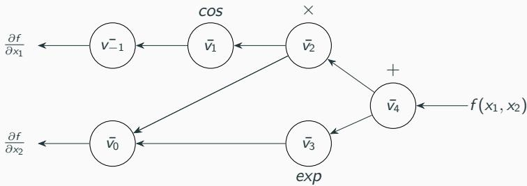  
Figure 9: Backward computation graph of  $\partial f$

In this backward pass, we apply the reversed chain rule to get the adjoints.

Graphically, and after computing the partial derivatives during the forward pass:

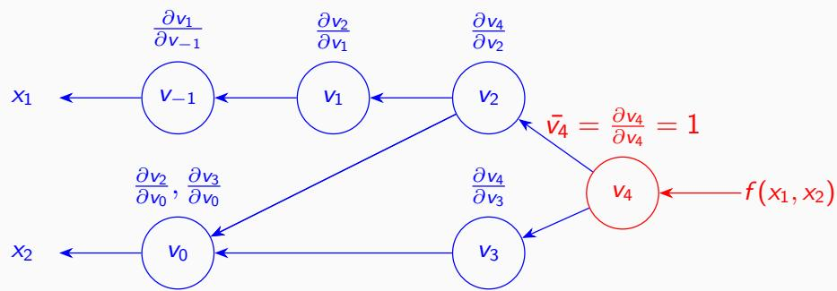  
Figure 10: Detailed chain rule in backward mode for  $f$

Graphically, and after computing the partial derivatives during the forward pass:

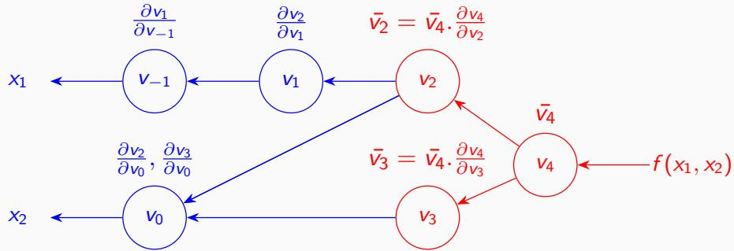  
Figure 10: Detailed chain rule in backward mode for  $f$

Graphically, and after computing the partial derivatives during the forward pass:

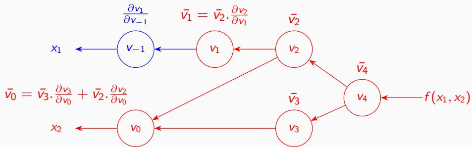  
Figure 10: Detailed chain rule in backward mode for  $f$

Graphically, and after computing the partial derivatives during the forward pass:

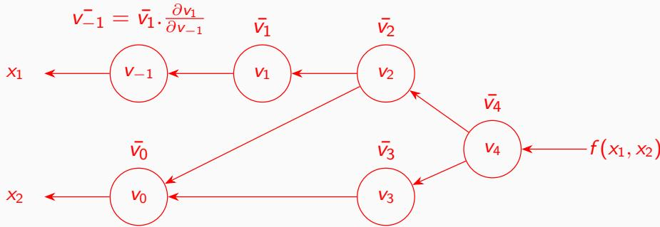  
Figure 10: Detailed chain rule in backward mode for  $f$

Table 2: Step-by-step computation of  $\partial f$  in backward mode  

<table><tr><td>Evaluation of f</td><td>Evaluation of the ∂f/∂xi</td></tr><tr><td>v-1=x1=π</td><td>v̅_1 = v̅_1. ∂v_1/∂v_1 = 0</td></tr><tr><td>v0=x2=1</td><td>v̅_0 = v̅_3. ∂v_3/∂v_0 + v̅_2. ∂v_2/∂v_0 = e - 1</td></tr><tr><td>v1=cos(v-1)=-1</td><td>v̅_1 = v̅_2. ∂v_2/∂v_1 = -1</td></tr><tr><td>v2=v0.v_1=-1</td><td>v̅_2 = v̅_4. ∂v_4/∂v_2 = -1</td></tr><tr><td>v_3=e^{v_0}=e</td><td>v̅_3 = v̅_4. ∂v_4/∂v_3 = e</td></tr><tr><td>v_4=v_2+v_3=e-1</td><td>v̅_4 = 1</td></tr></table>

Notice how this only required a single backward pass (instead of two in forward mode)!

In the general case of a function  $f: \mathbb{R}^m \to \mathbb{R}^n$ , its Jacobian matrix is given by:

$$
J _ {f} = \left[ \begin{array}{c c c c} \frac {\partial f _ {1}}{\partial x _ {1}} & \frac {\partial f _ {1}}{\partial x _ {2}} & \dots & \frac {\partial f _ {1}}{\partial x _ {m}} \\ \frac {\partial f _ {2}}{\partial x _ {1}} & \frac {\partial f _ {2}}{\partial x _ {2}} & \dots & \frac {\partial f _ {2}}{\partial x _ {m}} \\ \vdots & \vdots & \ddots & \vdots \\ \frac {\partial f _ {n}}{\partial x _ {1}} & \frac {\partial f _ {n}}{\partial x _ {2}} & \dots & \frac {\partial f _ {n}}{\partial x _ {m}} \end{array} \right] \tag {16}
$$

Notice how forward mode computes the Jacobian column by column, and backward mode row by row.

- if  $n > m$ , it's easier to compute  $J_{f}$  in forward mode ( $m$  passes)  
- if  $n < m$ , it's easier to compute  $J_{f}$  in backward mode ( $n$  passes)

$\rightarrow$  In our context, only backward mode is relevant because our cost functions have a very large number of inputs for only a single output ( $n = 1$ , the Jacobian has a single row).

# Generalization to automatic differentiation

# Autodiff implementation using a gradient tape

The principle of a backward mode autodiff implementation is to store the computation graph in a gradient tape (sometimes called a Wengert list, hence the  $W$  notation) which is built during the forward pass:

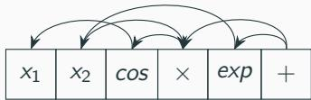  
Figure 11: Gradient tape of  $f$

Once the tape is fully built, each node contains:

- the partial derivatives of its variable with regard to their parent variables  
- the indices of its parent nodes

The gradient tape doesn't need to contain the values of the intermediate variables, only the partial derivatives.

Computing a gradient from a gradient tape is done using the following algorithm:

Algorithm 1: Gradient computation from a gradient tape in backward mode  
Input: gradient tape  $W$  of size  $k$ , variable  $\nu$  associated to the node  $W_{k}$   
Result: gradient  $\nabla$   
1  $\nabla \gets \{0\}_{0}^{|W|}$   
2  $\nabla_{k} \gets 1$   
/* Backward pass */  
3 for  $i \gets k$  to 1 do  
4 P ← parents(Wi)  
for  $j \gets 0$  to  $|P|$  do  
/* Index in  $P$  != Index in  $W$  or  $\nabla$  */  
j' ← index $_{\nabla}(P_j)$ $\nabla_{j'} \gets \nabla_{j'} + \frac{\partial C_i}{\partial W_k} \cdot \frac{\partial C_j}{\partial C_i}$   
end  
9 end

# Autodiff implementation using a gradient tape

An elegant way of implementing this is through operator overloading. This approach has multiple advantages:

- Almost transparent  
Gradient can simply be retrieved in a single function call  
Efficient

Remark: About tensor generalization...

- In a "realistic" neural network, the gradient tape would grow huge if we only considered scalar nodes!  
- To fix this, we can work directly on tensor nodes instead.  
- This makes it possible to write a matrix product in a single node, for instance!  
However, it is OK to focus on scalars for a first implementation.

# Gradient descent

The  $-\nabla$  hints us to the direction of a minimum of the cost function:

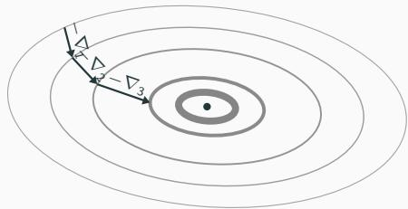  
Figure 12: Gradient descent example

By adjusting the model's parameters in small steps (ie. the weights and biases), we converge to a minimum of the cost function and our predictions become better and better!

The SGD (stochastic gradient descent) algorithm is the most basic optimization algorithm. For each training sample:

- We define a learning rate  $\eta$  (usually very small). This allows us to take small steps at a time and converge precisely.  
We compute  $\nabla$  on some training data  
We increment the model by  $-\eta \nabla$

After hundreds or thousands of iterations, the cost function should converge!

The basic SGD algorithm is the following:

Algorithm 2: Stochastic gradient descent (SGD) algorithm

Input: function  $f$ , initial parameters  $\theta$ , set of training updates  $U$ , epoch numbers  $e$ , learning rate  $\eta$

Result: optimized parameters  $\theta$

1 for  $i\gets 1$  to e do   
2 for  $j\gets 1$  to  $|U|$  do   
3  $\begin{array}{c}b\gets B_j\\ \nabla \leftarrow \nabla f_\theta (u_j)\\ \theta \leftarrow \theta -\eta \nabla \end{array}$    
4   
5   
6 end   
7 end

Problem: Updating the model after each training step makes it subject to overfitting, which can degrade the prediction's precision.

# The problem of overfitting

Overfitting happens when a model has been trained to correspond too closely to a particular set of data, making it less general and less efficient at making predictions on new, unseen data.

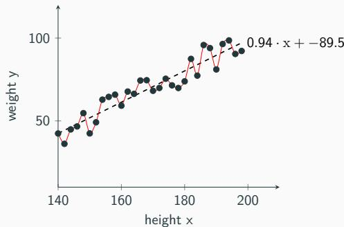  
Figure 13: Example of overfitting against the linear regression example: the model fits each training instance too closely.

Remark: Overfitting is also more likely when using a model with too many parameters.

To solve this issue, we often group the training inputs in small batches, and update the model only once per batch:

Input: function  $f$ , initial parameters  $\theta$ , set of batches  $B$ , epoch numbers  $e$ , learning rate  $\eta$

Result: optimized parameters  $\theta$

Algorithm 3: Batched SGD algorithm  
1 for  $i\gets 1$  to e do  
10 end  
```latex
for  $j\gets 1$  to  $|B|$  do   
3  $\begin{array}{l}b\gets B_j\\ \nabla_{acc}\gets \{0\}_{k = 1}^{|\theta |}\\ \text{for} k\gets 1\text{to}|b|\text{do}\\ |\nabla_{acc}\gets \nabla_{acc} + \nabla f_\theta (b_k)\\ \text{end}\\ \theta \leftarrow \theta -\eta \nabla_{acc} \end{array}$    
4   
5   
6   
7   
8   
9
```

The variable  $\nabla_{acc}$  is called a gradient accumulator.

# Steps for implementation

Once you are familiar with all the theory, here are the different steps you should follow during the first semester:

- Implement a simple MLP (forward pass only for now).  
- Implement a simple autodiff engine working in backward mode to generate the gradient tape.  
- Make sure it supports matrix/vector nodes. You will need to implement the matrix (or matrix-vector) product, the element-wise sums and products, and an element-wise activation function.

- This includes being able to compute the partial derivatives of those operations.

- Combine the two, as to be able to compute the MLP's gradient  
- Implement the SGD algorithm, activation function, weights and biases initialization, ...  
- Combine all of this on the MNIST dataset (you will be given some code to read the data files so you can focus on the most important part of the project).

After all that, you will have implemented a functional MNIST solver! During the second semester, the goal will be to improve its performance and accuracy.