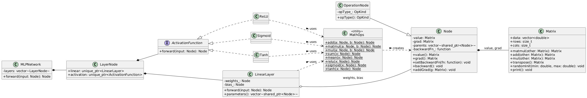
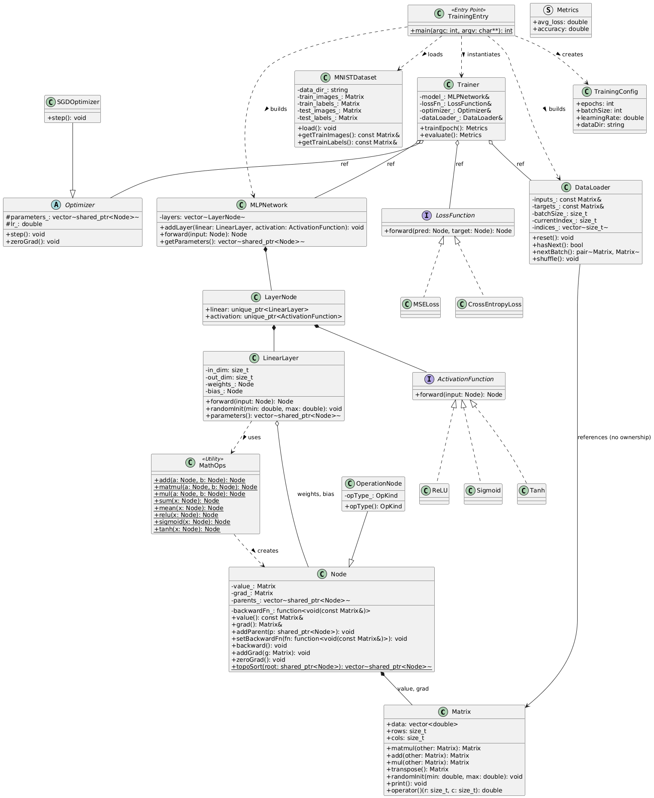

# Conception Détaillée

## Architecture Logicielle

Le projet implémente un moteur de Deep Learning complet en C++ moderne (C++17), organisé en trois couches principales :

```
┌─────────────────────────────────────────────────────────┐
│                    main.cpp (CLI)                       │
├─────────────────────────────────────────────────────────┤
│              Trainer / MLPNetwork                       │
├───────────────────────┬─────────────────────────────────┤
│   Loss + Optimizer    │   LinearLayer + Activation      │
├───────────────────────┴─────────────────────────────────┤
│              Node + MathOps (Autodiff)                  │
├─────────────────────────────────────────────────────────┤
│                  Matrix / Tensor                        │
└─────────────────────────────────────────────────────────┘
```

## Diagramme de Classes UML

### Phase 3 : Propagation Avant / Arrière



### Phase 4-6 : Entraînement Complet



## Composants Principaux

### 1. Noyau de Calcul (`Matrix`)

- Stockage contigu (`std::vector<double>`) pour la localité cache
- Implémentations multiples de `matmul` :
  - Naïf (ijk) : pédagogique
  - Réordonné (ikj) : cache-friendly
  - OpenMP : parallélisation multi-threads
  - BLAS : performance optimale

### 2. Moteur d'Autodifférentiation (`Node`, `MathOps`)

- Graphe de calcul dynamique (DAG)
- Gestion mémoire via `std::shared_ptr`
- Rétropropagation par tri topologique
- Lambdas C++ pour définir les gradients locaux

### 3. Couches du Réseau (`LinearLayer`, `ActivationFunction`)

- `LinearLayer` : y = xW + b
- Activations : ReLU, Sigmoid, Tanh
- Initialisations : He, Xavier, Manual

### 4. Entraînement (`Trainer`, `Optimizer`, `LossFunction`)

- `SGDOptimizer` : mise à jour des paramètres
- `CrossEntropyLoss` : softmax numériquement stable
- `DataLoader` : génération de mini-batchs

## Choix de Conception

| Aspect | Choix | Justification |
|--------|-------|---------------|
| Langage | C++17 | Contrôle mémoire, performance, cohérence HPC |
| Graphe de calcul | Dynamique (DAG) | Flexibilité architecturale |
| Gestion mémoire | `shared_ptr` | Graphes non-linéaires, pas de fuites |
| Gradients locaux | Lambdas | Réduction du boilerplate |
| Rétropropagation | Itératif (topo-sort) | Évite récursion profonde |

## Flux de Données (Mini-batch)

```
DataLoader → MLPNetwork.forward() → LossFunction → backward() → Optimizer.step()
```

Pour plus de détails, consulter le rapport LaTeX : [ProjetRapportlatex/rapport.pdf](../ProjetRapportlatex/rapport.pdf)
