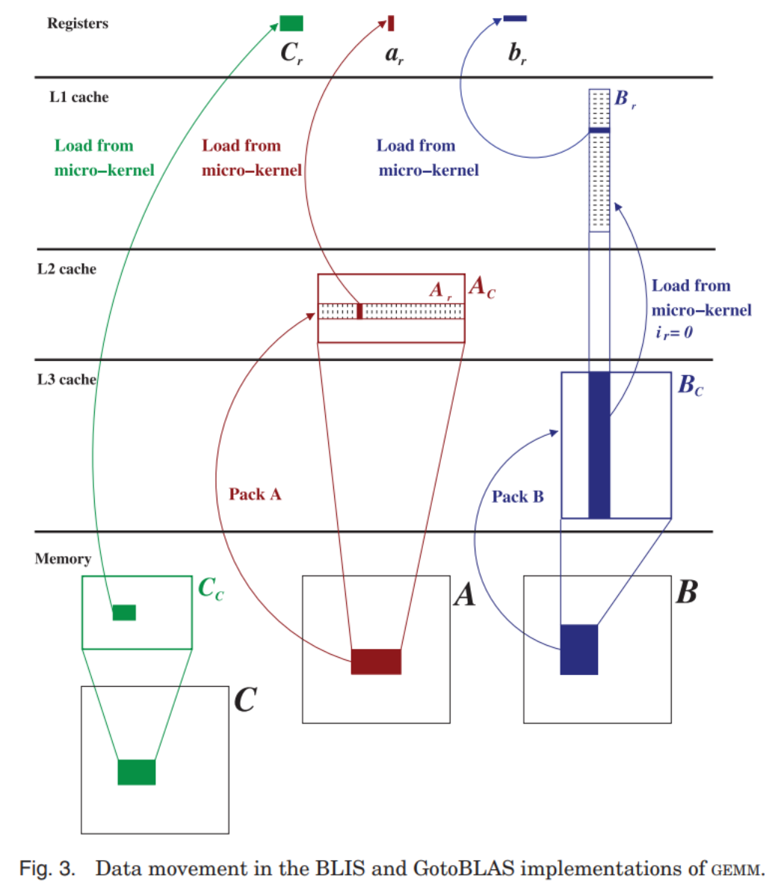
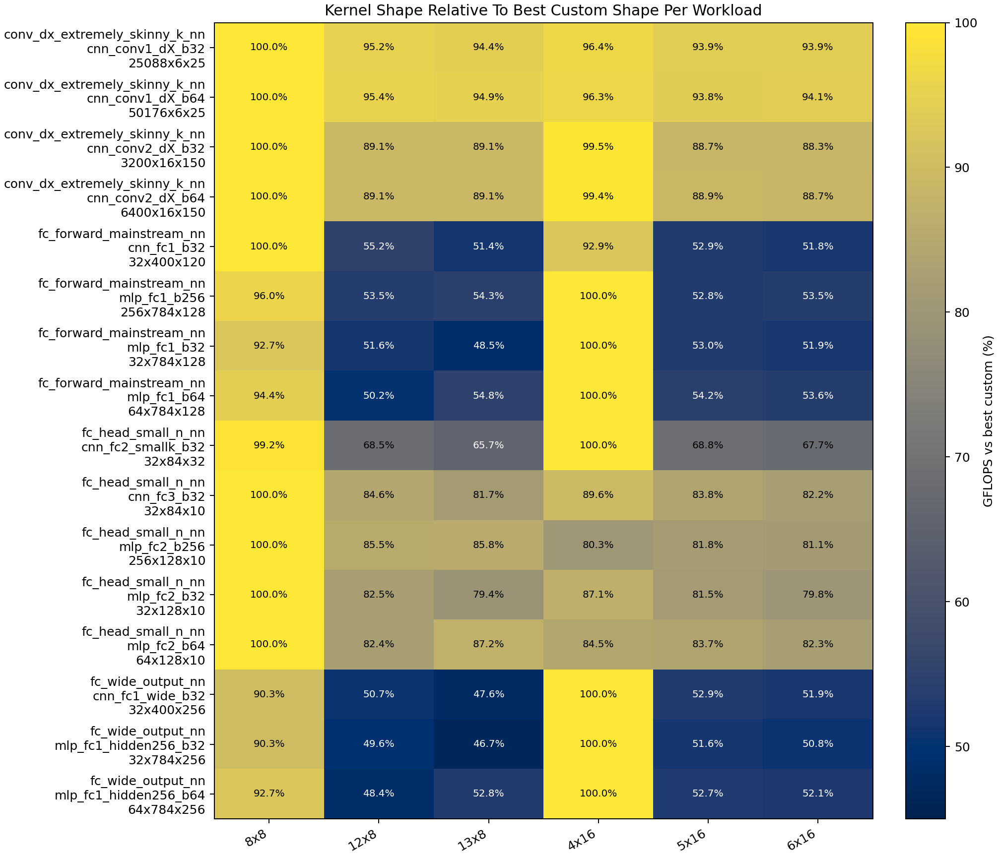
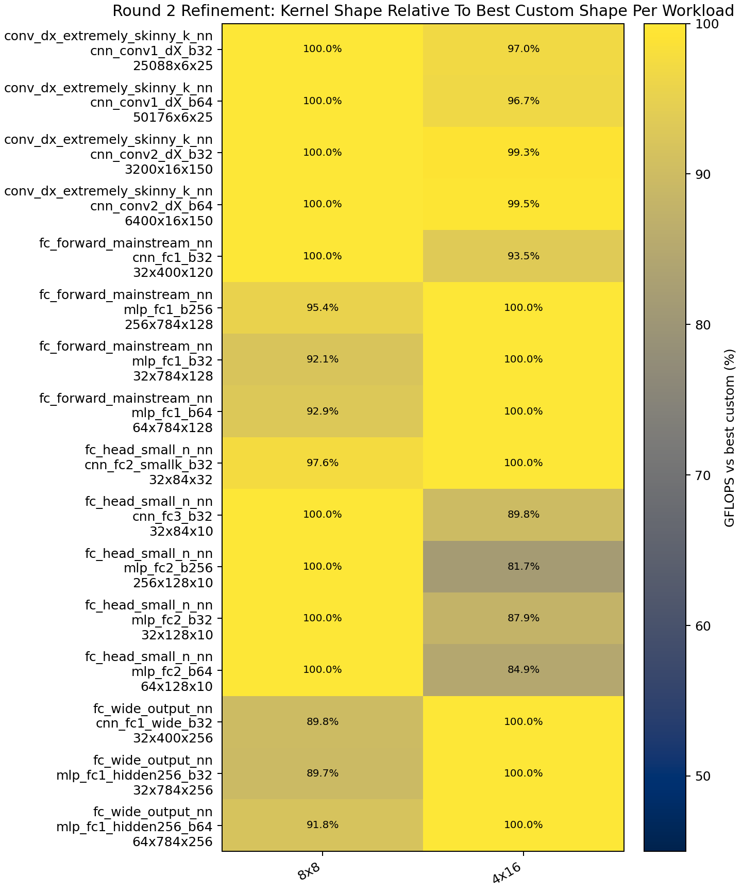
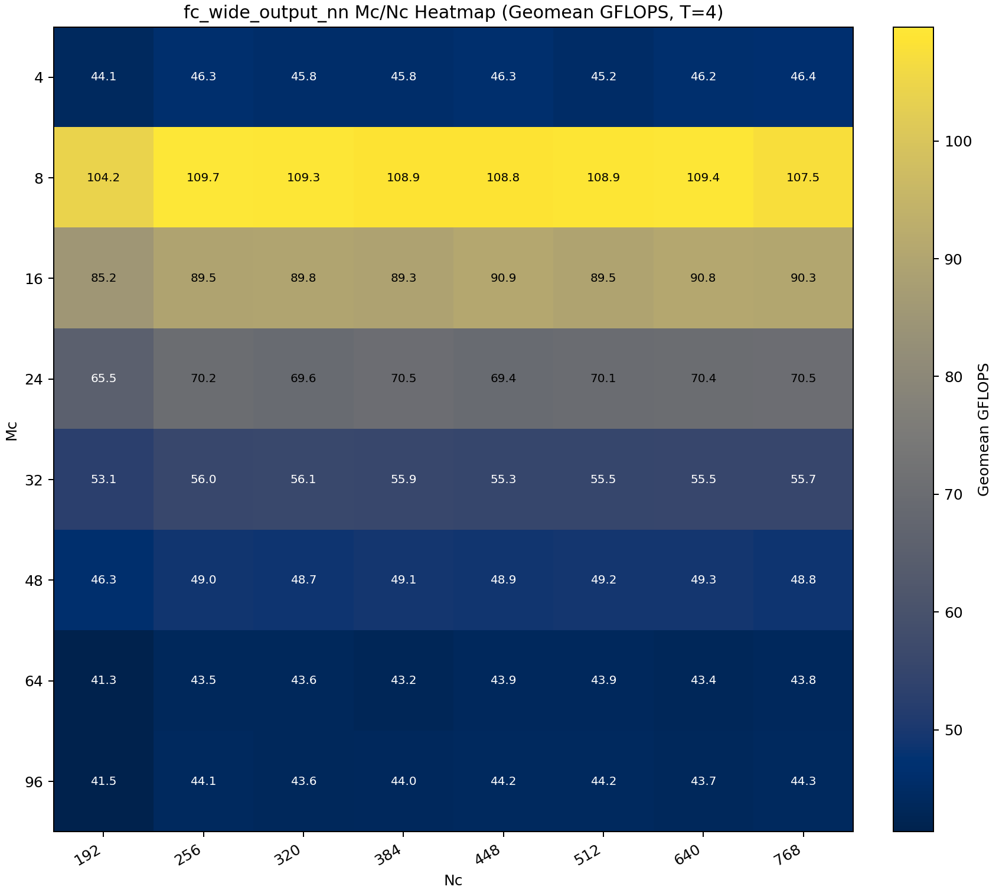

# 当前 GEMM GetoBLAS 的实现的分块参数建模

本文讨论 `src/gemm/GEMMGotoBLAS.cpp` 中 GotoBLAS 风格 AVX2 路径的参数建模。实现入口、dispatch 机制、packing / micro-kernel / macro-kernel 的结构说明见 [ImplGemmGotoBLAS.md](./ImplGemmGotoBLAS.md)。本文只处理符号、分块参数、公式适用条件以及当前实现与 BLIS 参数模型之间的边界。本文最终输出为 blocked-size 候选集合，以及面向多线程实现的并行方案建模与优先验证口径；本文不对当前默认值的全局最优性作出证明。

## 1. 符号与建模对象

当前实现的宏内核围绕固定的寄存器块 $C_r$ 展开，其中

$$
C_r \in \mathbb{R}^{m_r \times n_r}, \qquad
A_r \in \mathbb{R}^{m_r \times k_c}, \qquad
B_r \in \mathbb{R}^{k_c \times n_r}.
$$

`pack_a_micro_panel` 将 $A_r$ 重排为 $P_A$：

$$
P_A[p \cdot m_r + i] = A_r(i,p),
$$

`pack_b_micro_panel` 将 $B_r$ 重排为 $P_B$：

$$
P_B[p \cdot n_r + j] = B_r(p,j).
$$

因此，对固定的 $p$，$A_r(:,p)$ 作为 $m_r$ 个标量连续存放，$B_r(p,:)$ 作为 $n_r$ 个连续元素连续存放。外层块仍记为

$$
A_c \in \mathbb{R}^{m_c \times k_c}, \qquad
B_c \in \mathbb{R}^{k_c \times n_c}.
$$

Notation Quick Reference

| symbol | meaning |
| --- | --- |
| $C_r$ | micro-kernel 更新的寄存器块，尺寸为 $m_r \times n_r$ |
| $A_r$ | 与 $C_r$ 对应的 packed $A$ 微面板，尺寸为 $m_r \times k_c$ |
| $B_r$ | 与 $C_r$ 对应的 packed $B$ 微面板，尺寸为 $k_c \times n_r$ |
| $A_c$ | 线程私有的较大 $A$ 工作块，尺寸为 $m_c \times k_c$ |
| $B_c$ | 线程共享的较大 $B$ 工作块，尺寸为 $k_c \times n_c$ |
| $\mathcal{K}$ | $k_c$ 的离散候选集合 |
| $\mathcal{M}$ | $m_c$ 的离散候选集合 |
| $\mathcal{N}$ | $n_c$ 的离散候选集合 |

## 1.1 建模语句的三种地位

本文对分块参数的表述分成三类。第一类是精确等式，只用于代码语义、尺寸定义、packed buffer 布局、当前实现快照以及精确字节规模计算。第二类是可行域不等式，用于表达寄存器预算、吞吐下界、cache 容量和 TLB 覆盖等约束，它们只裁剪过小或过大的不合理区域。第三类是启发式中心值，用于从 cache set-mapping 或面板跨度关系中构造候选中心；这类关系式给出的不是理论唯一最优值，而是候选区间的中心或代表点。

因此，本文不是为当前固定默认值辩护。本文的建模重点是从寄存器、cache 和 TLB 约束中导出 blocked size 候选集合；当前固定值仅作为当前实现状态的记录点与后续实验比较基线。

## 2. 标准建模前提与当前实现的偏离

BLIS 参数模型默认的前提是：单线程、双精度、以向量 FMA 为核心的 rank-1 update 微内核，以及由 set-associative cache 和 TLB 约束出的分块选择。当前实现与这一框架在符号层和循环层次上是一致的，但有三处关键偏离。第一，数据类型是 `float`，因此容量公式中的元素字节数取

$$
S_{\text{data}} = 4,
$$

而不是论文中的双精度字节数。第二，微内核按 $n_r$ 方向向量化：每个 `__m256` 保存 $C_r$ 的一整行，循环内先读取 $B_r(p,:)$ 的向量，再广播 $A_r(:,p)$ 的标量。第三，外层实现采用 OpenMP 并行，$A_c$ 是线程私有工作集，而 $B_c$ 在 `#pragma omp single` 中打包后由线程共享读取。

这些偏离不影响 $m_r,n_r,k_c,m_c,n_c$ 的记号使用，但会改变公式的解释方式。与寄存器映射直接相关的推导必须按当前数据流重写；与 cache 容量、面板大小和 stride 相关的关系式大多仍可沿用，但它们在本文中分别扮演可行域约束或候选中心构造的角色，而不是替代实测。

本节偏离条件可概括为

$$
\begin{aligned}
S_{\text{data}} &= 4,\\
\text{SIMD 方向} &\text{沿 } n_r,\\
A_c &\text{ 为线程私有工作集},\quad B_c \text{ 为线程共享工作集}.
\end{aligned}
$$

## 3. $m_r$ 与 $n_r$ 的实现相关推导

当前微内核在每次 $p$ 迭代中执行 $C_r(i,:) \leftarrow C_r(i,:) + A_r(i,p)\,B_r(p,:)$，其中 $0 \le i < m_r$。这里 $B_r(p,:)$ 被一次性装入一个 AVX2 向量寄存器，$A_r(i,p)$ 则通过标量广播参与 FMA。语义上的 $m_r \times n_r$ 小块没有变化；变化的是寄存器表示法，SIMD lane 对应的是 $n_r$ 维度，而不是某些论文示例中更常见的 $m_r$ 维度。因此，寄存器方向的变化不能被表述为 $m_r$ 与 $n_r$ 的互换。

令 $N_{\text{vec}}$ 表示一个向量寄存器可容纳的标量数。对 AVX2 `float32`，$N_{\text{vec}} = \frac{256}{32} = 8$。在参数优化语境中，$n_r$ 至少需要满足向量化粒度约束，并通常取为 $N_{\text{vec}}$ 的整数倍，即 $n_r = t\,N_{\text{vec}}$，其中 $t \in \mathbb{Z}_{\ge 1}$。若一个 $B_r(p,:)$ 在同一次迭代中由两个 YMM 寄存器共同承载，$n_r$ 也可以取 16。本文后续只考虑 $t \in \{1,2\}$，亦即 $n_r \in \{8,16\}$，暂不讨论 $n_r = 24,32$ 这类更宽的 $n$ 方向微内核。

$m_r$ 的约束来自吞吐隐藏和寄存器预算。BLIS 论文中关于微内核的基本条件可写为 $m_r n_r \ge N_{\text{vec}} L_{\text{vfma}} N_{\text{vfma}} = 8 \times 4 \times 2 = 64$，其中 $L_{\text{vfma}}$ 是向量 FMA 的相关延迟，当前可取 4 作为一阶建模值；$N_{\text{vfma}}$ 是每周期可发射的向量 FMA 数，当前可取 2 作为一阶建模值，这给出了吞吐下界。

寄存器预算不能再写成与 $n_r$ 无关的统一形式，因为当 $n_r = 8$ 时，每一行累加器只占 1 个 YMM；当 $n_r = 16$ 时，每一行累加器占 2 个 YMM。令 $t = n_r / N_{\text{vec}} = n_r / 8$，则累加器寄存器数为 $m_r t$。因此，寄存器预算至少应写成依赖 $t$ 的形式：若一次迭代中只额外保留 1 个 $B$ 向量临时寄存器，则有 $m_r t + 1 + \delta \le N_{\text{reg}} = 16$；若进一步针对 $n_r = 16$ 采用更保守的建模，即认为两个 $B$ 子向量都需要同时保留，则有 $m_r t + t + \delta \le N_{\text{reg}} = 16$。其中 $N_{\text{reg}}$ 是可用向量寄存器数，$\delta$ 是留给广播、地址生成和调度的余量，且 $\delta \in [1,3]$。

因此必须分情况讨论。当 $n_r = 8$，即 $t = 1$ 时，吞吐下界给出 $m_r \cdot 8 \ge 64 \Rightarrow m_r \ge 8$，而乐观寄存器预算给出 $m_r + 1 + \delta \le 16$。当 $\delta \in [1,3]$ 时，可得到 $8 \le m_r \le 13$，因此当前建模下可保留 $m_r \in \{8,9,10,11,12,13\}$。当 $n_r = 16$，即 $t = 2$ 时，吞吐下界给出 $m_r \cdot 16 \ge 64 \Rightarrow m_r \ge 4$。乐观寄存器预算变为 $2m_r + 1 + \delta \le 16$，更保守的预算写法则为 $2m_r + 2 + \delta \le 16$。因此，$n_r = 16$ 时的可行 $m_r$ 区间会明显缩小；若取稳妥候选，则可写成 $m_r \in \{4,5,6\}$，而 $m_r = 7$ 只在“$n_r = 16$ 且仅保留 1 个 $B$ 向量临时寄存器”的较乐观预算下才可能保留。

综上，本节给出的可行域不再是统一的 $m_r \le 13$，而是依赖 $n_r/8$ 的分情况约束：

$$
\begin{aligned}
n_r &\in \{8,16\},\\
m_r n_r &\ge 64,\\
m_r \frac{n_r}{8} + 1 + \delta &\le 16 \quad \text{(较乐观写法；当 } n_r=16 \text{ 时表示只保留 1 个 } B \text{ 向量临时寄存器)},\\
m_r \frac{n_r}{8} + \frac{n_r}{8} + \delta &\le 16 \quad \text{(较保守写法；对 nr​=16 等价于同时保留全部 B 子向量)}.
\end{aligned}
$$

据此，原始可行域中的 $(m_r,n_r)$ 候选组合可写为

$$
\{(8,8),(9,8),(10,8),(11,8),(12,8),(13,8),(4,16),(5,16),(6,16)\},
$$

其中 $(7,16)$ 只在较乐观的寄存器预算下才可能保留，因此这里不将其放入默认候选集合。为控制后续搜索规模，本文后续固定保留的 $(m_r,n_r)$ 候选集合为 $\{(8,8),(12,8),(13,8),(4,16),(5,16),(6,16)\}$。

## 4. $k_c$ 的缓存模型

给定上一节的 $(m_r,n_r)$ 候选，$k_c$ 决定的是在固定微面板截面 $A_r \in \mathbb{R}^{m_r \times k_c}$、$B_r \in \mathbb{R}^{k_c \times n_r}$ 下沿 $k$ 方向延伸多深。因此，本节讨论的是依赖于 $(m_r,n_r)$ 的面板深度候选集合，而不是脱离微内核形状的全局常数。

### 4.1 基于 L1 / set-mapping 的 $k_c$ 约束

BLIS 论文对 $k_c$ 的分析建立在“$B_r$ 尽量驻留在 L1，而连续的 $A_r$ 流经 L1 并覆盖旧面板”的假设上。对当前实现，这一思路仍可保留，因为三件关键事实没有变化：$B_r$ 仍是跨多个 `ir` 迭代复用的对象；相邻 $A_r$ 微面板在 packed 缓冲区中的跨度仍是 $m_r k_c S_{\text{data}}$；微内核对两者仍保持单位步长访问。若记 $C_{A_r}$ 为 $A_r$ 在 L1 每个 set 中占据的 cache line 数，$C_{B_r}$ 为 $B_r$ 在每个 set 中占据的 line 数，L1 的 set 数、line 大小和相联度分别为 $N_{L1}$、$C_{L1}$、$W_{L1}$，则标准关系可写为

$$
m_r k_c S_{\text{data}} = C_{A_r} N_{L1} C_{L1}, \qquad
C_{A_r} + C_{B_r} \le W_{L1} - 1, \qquad
C_{B_r} \approx \left\lceil \frac{n_r}{m_r} C_{A_r} \right\rceil.
$$

从而得到

$$
C_{A_r} \le \left\lfloor \frac{W_{L1}-1}{1+n_r/m_r} \right\rfloor,
\qquad
k_c^{\text{center}} \approx \frac{C_{A_r} N_{L1} C_{L1}}{m_r S_{\text{data}}}.
$$

对当前机器，取 $W_{L1}=8$、$N_{L1}=64$、$C_{L1}=64\text{B}$、$S_{\text{data}}=4\text{B}$，则

$$
k_c^{\text{center}} \approx \frac{64 \cdot 64}{4}\frac{C_{A_r}}{m_r} = \frac{1024\,C_{A_r}}{m_r}.
$$

这里的 $k_c^{\text{center}}$ 只承担当前硬件上的候选中心角色。不能直接照搬的是依赖 LRU 年龄顺序的叙述，因为当前微内核在每个 $p$ 迭代中先读取 $B_r(p,:)$，后广播 $A_r(:,p)$ 的标量；因此，L1 模型在本文中用于给出中心值与离散候选的生成起点，而不是唯一最优值。

### 4.2 基于 TLB / page-footprint 的 $k_c$ 约束

仅由 L1 / set-mapping 关系确定 $k_c$ 仍然不够，因为随着 $k_c$ 增大，微面板与宏面板的 page footprint 都会同步扩大。若页大小为 $P$，则微面板级 footprint 近似满足

$$
\frac{m_r k_c S_{\text{data}}}{P} \lesssim E_{A_r,\mathrm{TLB}},
\qquad
\frac{k_c n_r S_{\text{data}}}{P} \lesssim E_{B_r,\mathrm{TLB}},
$$

这类弱裁剪通常只起提醒作用，因此本文采用更强的宏面板级裁剪。为把 TLB 层实例化为可执行规则，这里暂定使用 $m_c=128$、$n_c=512$ 作为 provisional panel volumes；它们只服务于当前轮次的 TLB-aware pruning，不代表最终 blocking 结论。对 $P=4096$，有

$$
\mathrm{pages}(A_c) \approx \left\lceil \frac{m_c k_c S_{\text{data}}}{P} \right\rceil
= \left\lceil \frac{128 \cdot k_c \cdot 4}{4096} \right\rceil
= \left\lceil \frac{k_c}{8} \right\rceil,
$$

$$
\mathrm{pages}(B_c) \approx \left\lceil \frac{k_c n_c S_{\text{data}}}{P} \right\rceil
= \left\lceil \frac{k_c \cdot 512 \cdot 4}{4096} \right\rceil
= \left\lceil \frac{k_c}{2} \right\rceil.
$$

当前机器的 L1 DTLB 和 L2 DTLB 条目数分别为 72 和 3072。由于 $B_c$ 的页数对本节候选远小于 L2 DTLB 容量，真正有区分度的裁剪来自线程私有的 $A_c$。为给栈、$C$ 块、代码和其他数据保留余量，这里取保守的有效预算 $E_{A,\mathrm{eff}}=0.75 \times 72 = 54$，并采用如下 pruning 规则：若某个候选使 $\mathrm{pages}(A_c) > 54$，则将其从第一轮实验集合中剔除；若 $\mathrm{pages}(A_c) \le 54$ 且 $\mathrm{pages}(B_c) \ll 3072$，则该候选通过当前 TLB 层检查。该层只承担近似过滤作用，不承担新的中心值生成。

### 4.3 综合 L1 与 TLB 约束的 $k_c$ 候选生成

候选生成分两步进行。第一步，由 L1 模型围绕候选中心生成原始离散集合。若记 $g_k$ 为 $k_c$ 的实现对齐粒度，则有

$$
\mathcal{K}_{\mathrm{L1}}(m_r,n_r) = \mathrm{Align}_{g_k}\bigl(\{ \alpha\, k_c^{\text{center}}(m_r,n_r) : \alpha \in \mathcal{A}_k \}\bigr),
$$

其中 $g_k$ 由 packed panel 的步长与外层块循环粒度决定，$\mathcal{A}_k$ 表示围绕 1 的有限比例邻域。为控制第一轮搜索规模，这里取保守实例化 $g_k=32$、$\mathcal{A}_k=\{0.75,1.00,1.25\}$。

第二步，由 TLB / page-footprint 条件对 $\mathcal{K}_{\mathrm{L1}}(m_r,n_r)$ 做一次近似裁剪，得到第一轮实验集合

$$
\mathcal{K}_{\mathrm{pruned}}(m_r,n_r) \subseteq \mathcal{K}_{\mathrm{L1}}(m_r,n_r).
$$

这里的 $k_c^{\text{center}}$、$\mathcal{K}_{\mathrm{L1}}$ 和 $\mathcal{K}_{\mathrm{pruned}}$ 都依赖于给定的 $(m_r,n_r)$。后续实验可以对每个 $(m_r,n_r)$ 分别搜索，也可以把各个候选集合并成一个并集候选池，但层次关系保持不变：L1 先生成，TLB 再裁剪。

对第 3 节最终保留的 6 组 $(m_r,n_r)$ 候选，按 $C_{A_r}^{\max}=\left\lfloor \frac{7}{1+n_r/m_r} \right\rfloor$ 与 $k_c^{\text{center}} \approx \frac{1024\,C_{A_r}^{\max}}{m_r}$ 计算，可得到表 4.1。表中先给出 $\mathcal{K}_{\mathrm{L1}}(m_r,n_r)$，再给出经 TLB 层筛查后的 $\mathcal{K}_{\mathrm{pruned}}(m_r,n_r)$；其中使 provisional $A_c$ 页数超过 54 的偏大候选被实际剔除。

| $(m_r,n_r)$ | $C_{A_r}^{\max}$ | $k_c^{\text{center}}$ | $\mathcal{K}_{\mathrm{L1}}(m_r,n_r)$ | max $pages(A_c)$ among $\mathcal{K}_{\mathrm{L1}}$ | TLB-pruned $\mathcal{K}_{\mathrm{pruned}}(m_r,n_r)$ |
| --- | ---: | ---: | --- | ---: | --- |
| $(8,8)$ | 3 | $384.0$ | $\{288,384,480\}$ | $60$ | $\{288,384\}$ |
| $(12,8)$ | 4 | $341.3$ | $\{256,352,416\}$ | $52$ | $\{256,352,416\}$ |
| $(13,8)$ | 4 | $315.1$ | $\{224,320,384\}$ | $48$ | $\{224,320,384\}$ |
| $(4,16)$ | 1 | $256.0$ | $\{192,256,320\}$ | $40$ | $\{192,256,320\}$ |
| $(5,16)$ | 1 | $204.8$ | $\{160,192,256\}$ | $32$ | $\{160,192,256\}$ |
| $(6,16)$ | 1 | $170.7$ | $\{128,160,224\}$ | $28$ | $\{128,160,224\}$ |

这些 $\mathcal{K}_{\mathrm{pruned}}(m_r,n_r)$ 构成第一轮 $k_c$ 搜索候选。它们来自“当前硬件上的中心值 + 32 对齐 + 有限比例邻域”，再经一层 page-footprint / TLB 过滤；例如 $1.25$ 比例产生的 $k_c=480$ 在 $(8,8)$ 这一行中因 provisional $A_c$ 页数达到 60、超过有效 L1 DTLB 预算 54 而被剔除。

本节约束可概括为

$$
\begin{aligned}
C_{A_r} + C_{B_r} &\le W_{L1} - 1,\\
C_{A_r} &\le \left\lfloor \frac{W_{L1}-1}{1+n_r/m_r} \right\rfloor,\\
k_c^{\text{center}} &\approx \frac{1024\,C_{A_r}}{m_r},\\
\mathcal{K}_{\mathrm{L1}}(m_r,n_r) &= \mathrm{Align}_{g_k}\bigl(\{ \alpha\, k_c^{\text{center}}(m_r,n_r) : \alpha \in \mathcal{A}_k \}\bigr),\\
\mathcal{K}_{\mathrm{pruned}}(m_r,n_r) &\subseteq \mathcal{K}_{\mathrm{L1}}(m_r,n_r).
\end{aligned}
$$

## 5. 单线程基础 $m_c / n_c$ 候选生成

在当前实现中，$m_c$ 与 $n_c$ 不是脱离前文分块层次的全局参数，而是建立在已经筛出的 $(m_r,n_r,k_c)$ 候选之上：一旦给定微内核形状和沿 $k$ 方向的面板深度，$m_c$ 决定 $A_c \in \mathbb{R}^{m_c \times k_c}$ 的私有工作集高度，$n_c$ 决定 $B_c \in \mathbb{R}^{k_c \times n_c}$ 的共享工作集宽度。因此，本节的目标不是解释固定默认值，而是把 cache / TLB 约束推进成单线程或弱并行情形下的基础候选集合。

### 5.1 基于 cache 的 $m_c / n_c$ 约束

$A_c$ 在当前实现中更接近线程私有工作集；$B_c$ 则对应在当前实现的多线程路径中更容易成为共享读取对象的面板，因此本节仍先以单线程基础候选的角色讨论其体积。两者的字节规模分别为

$$
|A_c| = m_c k_c S_{\text{data}},
\qquad
|B_c| = k_c n_c S_{\text{data}}.
$$

基于 cache 层次，可写出最直接的尺度约束

$$
m_c k_c S_{\text{data}} \lesssim \rho_A S_{\text{private}},
\qquad
k_c n_c S_{\text{data}} \lesssim \rho_B S_{\text{shared}}.
$$

其中 $\rho_A,\rho_B \in (0,1)$ 不是硬件给定常数，而是用于保留冲突、代码和其他工作集余量的建模系数；这类关系式给出的是 $m_c^{\max}$ 与 $n_c^{\max}$ 的基础尺度上界，而不是唯一取值。对当前机器，单线程基础建模中取每核私有 L2 容量 $S_{\text{private}}=1\text{ MiB}$；为避免把完整 LLC 容量直接投影到单个 $B_c$ 面板上，取一个保守的 effective shared-cache budget $\rho_B S_{\text{shared}} = 1\text{ MiB}$。这里的 $1\text{ MiB}$ 不是硬件共享缓存总量，而只是第一轮基础候选生成中施加在单个 $B_c$ 面板上的保守有效预算。再令 $\rho_A = 1/4$，则有

$$
m_c^{\max}(k_c) \approx \frac{\rho_A S_{\text{private}}}{k_c S_{\text{data}}}
= \frac{256\text{ KiB}}{4k_c}
= \frac{65536}{k_c},
$$

$$
n_c^{\max}(k_c) \approx \frac{\rho_B S_{\text{shared}}}{k_c S_{\text{data}}}
= \frac{1\text{ MiB}}{4k_c}
= \frac{262144}{k_c}.
$$

因此，cache 层在本节中的角色是给出随 $k_c$ 变化的基础尺度上界 $m_c^{\max}(k_c)$ 与 $n_c^{\max}(k_c)$，后续离散候选将在这些上界附近生成。

### 5.2 基于 TLB / page-footprint 的 $m_c / n_c$ 约束

仅有 cache 尺度上界仍然不够，因为 $A_c$ 和 $B_c$ 的页覆盖会随 $m_c$ 与 $n_c$ 同步放大。若页大小为 $P$，则两者的近似页覆盖为

$$
\frac{m_c k_c S_{\text{data}}}{P},
\qquad
\frac{k_c n_c S_{\text{data}}}{P},
$$

对应的近似 TLB 裁剪条件可写为

$$
\frac{m_c k_c S_{\text{data}}}{P} \lesssim E_{A,\text{TLB}},
\qquad
\frac{k_c n_c S_{\text{data}}}{P} \lesssim E_{B,\text{TLB}}.
$$

这些式子并不是精确硬约束，因为当前代码并不控制 huge page、STLB、NUMA 归属或线程绑定；在本节中，它们只承担对 cache 生成候选做第二层 pruning 的作用，而不是新的中心值来源。对当前机器，取 $P=4096$、L1 DTLB 条目数 72、L2 DTLB 条目数 3072，并采用保守的有效预算 $E_{A,\text{eff}}=54$ 与 $E_{B,\text{eff}}=192$；其中 $192$ 不是 L2 DTLB 的硬件条目数，而只是第一轮单线程基础候选生成中用于抑制过宽 $B_c$ 的保守有效预算。则

$$
\mathrm{pages}(A_c) \approx \frac{m_c k_c}{1024},
\qquad
\mathrm{pages}(B_c) \approx \frac{k_c n_c}{1024}.
$$

于是，本节使用的 TLB-aware pruning 规则为：若某个 $m_c$ 候选使 $\mathrm{pages}(A_c) > 54$，则将其从 $\mathcal{M}_{\text{cache}}$ 中剔除；若某个 $n_c$ 候选使 $\mathrm{pages}(B_c) > 192$，则将其从 $\mathcal{N}_{\text{cache}}$ 中剔除。这里的 $E_{B,\text{eff}}$ 明显小于硬件 L2 DTLB 容量，其作用是把过宽的 $B_c$ 面板在第一轮基础搜索中先裁掉。

### 5.3 综合 cache 与 TLB 约束的单线程基础候选生成

对给定的 $(m_r,n_r,k_c)$ 候选，首先由 cache 上界生成原始离散集合

$$
\mathcal{M}_{\text{cache}}(m_r,n_r,k_c)
= \mathrm{AlignDown}_{g_m}\bigl(\{\beta\, m_c^{\max}(k_c) : \beta \in \mathcal{A}_m\}\bigr),
$$

$$
\mathcal{N}_{\text{cache}}(m_r,n_r,k_c)
= \mathrm{AlignDown}_{g_n}\bigl(\{\gamma\, n_c^{\max}(k_c) : \gamma \in \mathcal{A}_n\}\bigr),
$$

再由 TLB / page-footprint 做一次裁剪，得到

$$
\mathcal{M}_{\text{pruned}} \subseteq \mathcal{M}_{\text{cache}},
\qquad
\mathcal{N}_{\text{pruned}} \subseteq \mathcal{N}_{\text{cache}}.
$$

为控制第一轮单线程基础搜索规模，这里取 $g_m=32$、$g_n=64$，并令 $\mathcal{A}_m=\mathcal{A}_n=\{0.5,0.75,1.0\}$。这里的 $\mathrm{AlignDown}$ 表示向下对齐到不超过目标值的最近粒度倍数。按同一规则，可对第 4 节保留下来的全部 $(m_r,n_r,k_c)$ 组合逐项构造单线程基础候选，如表 5.1 所示。

| $(m_r,n_r,k_c)$ | $m_c^{\max}$ | $\mathcal{M}_{\text{cache}}$ | $\mathcal{M}_{\text{pruned}}$ | $n_c^{\max}$ | $\mathcal{N}_{\text{cache}}$ | $\mathcal{N}_{\text{pruned}}$ |
| --- | ---: | --- | --- | ---: | --- | --- |
| $(8,8,288)$ | $227.6$ | $\{96,160,224\}$ | $\{96,160\}$ | $910.2$ | $\{448,640,896\}$ | $\{448,640\}$ |
| $(8,8,384)$ | $170.7$ | $\{64,128,160\}$ | $\{64,128\}$ | $682.7$ | $\{320,512,640\}$ | $\{320,512\}$ |
| $(12,8,256)$ | $256.0$ | $\{128,192,256\}$ | $\{128,192\}$ | $1024.0$ | $\{512,768,1024\}$ | $\{512,768\}$ |
| $(12,8,352)$ | $186.2$ | $\{64,128,160\}$ | $\{64,128\}$ | $744.7$ | $\{320,512,704\}$ | $\{320,512\}$ |
| $(12,8,416)$ | $157.5$ | $\{64,96,128\}$ | $\{64,96,128\}$ | $630.2$ | $\{256,448,576\}$ | $\{256,448\}$ |
| $(13,8,224)$ | $292.6$ | $\{128,192,288\}$ | $\{128,192\}$ | $1170.3$ | $\{576,832,1152\}$ | $\{576,832\}$ |
| $(13,8,320)$ | $204.8$ | $\{96,128,192\}$ | $\{96,128\}$ | $819.2$ | $\{384,576,768\}$ | $\{384,576\}$ |
| $(13,8,384)$ | $170.7$ | $\{64,128,160\}$ | $\{64,128\}$ | $682.7$ | $\{320,512,640\}$ | $\{320,512\}$ |
| $(4,16,192)$ | $341.3$ | $\{160,256,320\}$ | $\{160,256\}$ | $1365.3$ | $\{640,1024,1344\}$ | $\{640,1024\}$ |
| $(4,16,256)$ | $256.0$ | $\{128,192,256\}$ | $\{128,192\}$ | $1024.0$ | $\{512,768,1024\}$ | $\{512,768\}$ |
| $(4,16,320)$ | $204.8$ | $\{96,128,192\}$ | $\{96,128\}$ | $819.2$ | $\{384,576,768\}$ | $\{384,576\}$ |
| $(5,16,160)$ | $409.6$ | $\{192,288,384\}$ | $\{192,288\}$ | $1638.4$ | $\{768,1216,1600\}$ | $\{768,1216\}$ |
| $(5,16,192)$ | $341.3$ | $\{160,256,320\}$ | $\{160,256\}$ | $1365.3$ | $\{640,1024,1344\}$ | $\{640,1024\}$ |
| $(5,16,256)$ | $256.0$ | $\{128,192,256\}$ | $\{128,192\}$ | $1024.0$ | $\{512,768,1024\}$ | $\{512,768\}$ |
| $(6,16,128)$ | $512.0$ | $\{256,384,512\}$ | $\{256,384\}$ | $2048.0$ | $\{1024,1536,2048\}$ | $\{1024,1536\}$ |
| $(6,16,160)$ | $409.6$ | $\{192,288,384\}$ | $\{192,288\}$ | $1638.4$ | $\{768,1216,1600\}$ | $\{768,1216\}$ |
| $(6,16,224)$ | $292.6$ | $\{128,192,288\}$ | $\{128,192\}$ | $1170.3$ | $\{576,832,1152\}$ | $\{576,832\}$ |

表 5.1 给出的 $\mathcal{M}_{\text{pruned}}$ 与 $\mathcal{N}_{\text{pruned}}$ 构成了单线程或弱并行情形下的基础候选集合。它们体现的是“cache 先给基础尺度，TLB 再裁掉偏大的点”这一两层结构，而不是对 $m_c / n_c$ 的最终定值。后续第 6 节再讨论这些基础候选如何受到 parallelization layer 与线程数 $T$ 的修正。

本节关系可概括为

$$
\begin{aligned}
m_c^{\max},n_c^{\max} &\text{ 由 cache 层给出基础尺度上界},\\
\mathcal{M}_{\text{pruned}} &\subseteq \mathcal{M}_{\text{cache}},\quad \mathcal{N}_{\text{pruned}} \subseteq \mathcal{N}_{\text{cache}},\\
(\mathcal{M}_{\text{pruned}},\mathcal{N}_{\text{pruned}}) &\text{ 构成单线程基础候选，后续再做多线程修正}.
\end{aligned}
$$

### 5.4 对单线程下候选组合性能测试的实验

#### 5.4.1 第一轮筛选实验

第一轮实验只针对单线程情形，目的不是直接给出最终 blocked-size，而是对前文筛出的候选组合做 coarse screening。实验在固定 `KernelShape` 与 `Kc` 的前提下，比对同一行上的不同 `Mc/Nc` 组合；得到各行局部优胜者后，再做跨行比较，用于收缩后续搜索空间。因此，这一轮结论只能被解释为单线程 candidate screening result，而不是对 blocked-size 最优性的最终证明。

测试集不再使用单一规则方阵，而是优先采用前文已经识别出的 representative workloads。当前单线程 NN 快路径覆盖的主测试集包括四类问题族：`fc_forward_mainstream_nn`、`fc_head_small_n_nn`、`fc_wide_output_nn` 与 `conv_dx_extremely_skinny_k_nn`。它们分别覆盖主流全连接层、小输出 head、宽输出层，以及卷积反传中 $K$ 很瘦的情形，能够反映本轮 blocked-size 筛选真正关心的结构差异。同一轮比较中的所有候选都在同一批 workload 上运行，避免因为更换测试题目引入额外偏差。

实验协议保持单线程受控执行。运行时显式设置 `OMP_NUM_THREADS=1`，同时关闭 OpenBLAS、GOTO、BLIS 与 MKL 的内部线程；候选统一绑定到同一物理核心，并在相同 governor / 频率策略下分别执行 timing 与 `perf stat`。主排序指标是 runtime 及其对应的 GFLOPS；`perf stat` 采集的 instructions、cycles、IPC、cache miss 与 dTLB miss 等指标只用于解释性能差异，不参与主排序。作为外部对照，同一批 workload 还运行单线程 OpenBLAS baseline，但它只参与跨行对照，不参与行内 `Mc/Nc` 选优。

第一轮筛选对应的可执行工具链包括四步：首先编译 `test_benchmark_large`；随后运行 `run_single_thread_blocked_candidates.py` 对自定义 `omp_gotoblas_avx2` 路径做候选扫描，并运行 `run_single_thread_openblas_baseline.py` 获取单线程 OpenBLAS 对照；之后通过 `summarize_single_thread_blocked_results.py` 生成 `candidate_aggregates.csv`、`row_winners.csv`、`cross_row_summary.csv` 与 `summary.md`；最后由 `plot_single_thread_blocked_heatmaps.py` 输出 kernel-shape 热图。失败样本不会中断整批实验，而是以 `Status=failed` 或 `Status=unsupported_kernel_shape` 直接写回原始 CSV。

结果统一写入 CSV。对于自定义 `omp_gotoblas_avx2` 路径，原始结果同时保留请求值与实际生效值：`RequestedKernelShape`、`RequestedMc`、`RequestedNc`、`RequestedKc` 对应脚本发出的候选请求，而 `KernelShape`、`Mc`、`Nc`、`Kc` 对应 benchmark 回读到的 runtime-effective 配置。汇总与画图统一按实际生效值分组。其余最小必需字段包括 `Implementation`、`RunType`、`WorkloadFamily`、`WorkloadId`、`Size`、`Threads`、`MeasurementKind`、`Time_us`、`GFLOPS`、`Reps` 与 `Status`；其中 `Size` 表示实际 workload 的 $(M,K,N)$。辅助列 `Instructions`、`Cycles`、`IPC`、`CacheMisses`、`L1DMisses`、`DTLBMisses` 等来自 `perf stat`，用于支持后续解释，但不改变本轮以 timing 为主的筛选口径。

从第一轮结果看，kernel shape 的优劣已经出现比较清晰的分层。在当前已测候选中，`8x8` 与 `4x16` 在大多数 representative workloads 上整体更稳定，因而可以作为下一轮精筛的主候选；相比之下，`12x8`、`13x8`、`5x16` 与 `6x16` 在多类 workload 上持续落后，现阶段没有继续作为重点搜索对象的必要。然后我们收缩候选集，并在相同 workload set、相同单线程执行协议与相同汇总口径的前提下，对 `Mc/Nc/Kc` 增加更密的候选组合，继续对 `8x8` 与 `4x16` 这两行主候选做第二轮精筛。

#### 5.4.2 基于优胜候选的继续精筛

第一轮筛选只用于排除明显较差的组合，并保留少数在 representative workloads 上表现稳定靠前的主候选。因此，后续实验应围绕这些优胜候选继续精筛，在保留相同 workload set、相同单线程执行协议与相同汇总口径的前提下，在保留第一轮优胜 KernelShape 与保留的 Kc 行的前提下，对各行内的 Mc/Nc 做更密的局部加密采样。

第二轮精筛的目的不是扩大测试面，而是检查第一轮优胜点的稳定性，并进一步提高单线程下的 blocked-size 选择结论的可信度。第二轮候选集是在第一轮优胜区域附近，按相同对齐粒度扩展得到的更密网格，第二轮的比较与汇总仍按 runtime-effective KernelShape/Mc/Nc/Kc 分组。

| KernelShape | Kc | Mc candidates | Nc candidates | Combination count |
| --- | ---: | --- | --- | ---: |
| `8x8` | 288 | `{96, 128, 160, 192}` | `{448, 512, 576, 640}` | 16 |
| `8x8` | 384 | `{64, 96, 128}` | `{320, 384, 448, 512}` | 12 |
| `4x16` | 192 | `{160, 192, 224, 256, 288}` | `{640, 768, 896, 1024}` | 20 |
| `4x16` | 256 | `{128, 160, 192}` | `{512, 576, 640, 704, 768}` | 15 |
| `4x16` | 320 | `{96, 128, 160}` | `{384, 448, 512, 576}` | 12 |

因此，第二轮总候选数为

$$
16 + 12 + 20 + 15 + 12 = 75.
$$

这一候选集的作用不是重新扩大搜索面，而是在第一轮已知优胜区域附近补足中间点。对 `8x8` 而言，新增点主要用于区分 $(K_c=288)$ 与 $(K_c=384)$ 两行在不同 workload family 上的稳定性，并检查 `Mc/Nc` 是否存在比第一轮粗采样更优的中间组合；对 `4x16` 而言，则分别围绕 $K_c \in \{192,256,320\}$ 的优胜区域补充更密的 `Mc/Nc` 网格，用于验证第一轮跨 workload 的优势是否在更细粒度搜索下仍然成立。

若进一步以当前 representative workloads 中的 CNN 类问题为优先目标，并需要从第二轮结果中选出一个单一的 CNN-first 默认候选，则较合适的选择是 `8x8 + Mc=64 + Nc=384 + Kc=384`。其依据不是全局最优性证明，而是当前 CNN 相关 workload 上的优胜次数统计：在 `cnn_conv1_dX_b64`、`cnn_conv2_dX_b32` 与 `cnn_conv2_dX_b64` 等卷积反传相关 shape 上，这一组合出现次数最多，因而可以作为后续面向 CNN 主路径的默认起点。需要强调的是，这一选择只反映当前单线程、当前 workload set 下的 CNN-first 候选口径，并不意味着它已经成为对全部 workload 普适的统一 blocked-size 结论。

## 6. 多线程并行方案与 blocked-size 的线程级含义

第 5 节已经完成当前阶段的单线程 shape + blocked-size 联合筛选。第 6 节转入多线程情形，讨论当前正式 baseline 下 blocked-size 的线程级含义，并简要说明其他尚未实现的并行层。

### 6.1 `ic / M` 层并行

#### （1）实现思路

`ic / M` 层并行是在固定 `(jc, pc)` 后，沿 `ic_block` 将 $M$ 方向的 $m_c$ 行块分配给不同线程。当前正式 baseline 实现即采用这一方案：外层按 `jc -> pc -> ic` 推进，`B_c` 在每个 `(jc, pc)` 上打包一次，然后多个线程分别处理不同的 `ic` 块，并对各自负责的 $C$ 行块执行更新。

#### （2）该并行方式下 blocked-size 的线程级含义

在该方案下，线程拿到的基本工作单元是一个 `ic` 行块，即大小近似为 $m_c \times n_c$ 的 $C$ 子块及其对应的 packed 数据。$m_c$ 首先控制线程任务高度、私有 working set、TLB 压力和可供分配的 `ic` 任务数；$n_c$ 首先控制共享 `B_c` 面板体积以及每个 `ic` 任务更新的列宽；$k_c$ 决定 `A_c/B_c` 的 packed 深度、packing 开销与跨 `pc` 的累计次数。若 $M$ 较小或 $m_c$ 较大，`ic` 任务数可能不足，线程利用率会受限。

#### （3）正式 baseline 下 $m_c / n_c$ 随线程数 $T$ 的经验调参结果

当前阶段已经完成一轮面向正式 baseline 的小规模多线程经验调参。该实验只覆盖当前正式实现路径 `MATMUL_IMPL=omp_gotoblas_avx2`，并保持并行层为 `ic / M`；本轮实验固定采用 `avx2_8x8` kernel shape，固定 $k_c = 384$，仅对 $m_c$ 与 $n_c$ 做网格扫描。本文当前正式展示的 thread-aware baseline 结果只保留 $T \in \{1,2,4\}$，以匹配本文的正式实验展示与后续 scaling 配置口径。对应的 $m_c$ 候选为 $\{4,8,16,24,32,48,64,96\}$，$n_c$ 候选为 $\{192,256,320,384,448,512,640,768\}$；workload set 采用 8 个代表性 NN GEMM 形状，覆盖 `fc_forward_mainstream_nn`、`fc_head_small_n_nn`、`fc_wide_output_nn` 与 `conv_dx_extremely_skinny_k_nn` 四类 family。比较指标使用跨所选 workload 的 geomean GFLOPS。表 6.1 只用于说明最佳点会随线程数变化；表 6.2 则给出本文最终采用的保守经验配置。

| $T$ | strict winner $m_c$ | strict winner $n_c$ | 固定 $k_c$ |
| ---: | ---: | ---: | ---: |
| 1 | 16 | 640 | 384 |
| 2 | 8 | 256 | 384 |
| 4 | 8 | 640 | 384 |

| 用途 | $T$ | 推荐 $m_c$ | 推荐 $n_c$ | 固定 $k_c$ |
| --- | ---: | ---: | ---: | ---: |
| Thread-aware empirical table | 1 | 8 | 448 | 384 |
| Thread-aware empirical table | 2 | 8 | 448 | 384 |
| Thread-aware empirical table | 4 | 8 | 448 | 384 |
| Fixed baseline config for scaling | 1, 2, 4 | 8 | 448 | 384 |

最终推荐不直接采用 strict winner，而采用更保守的代表值。当前结果显示，$m_c$ 是更敏感的主导变量，而 $n_c$ 更接近宽平台参数：$T \ge 2$ 时较优区域明显收缩到 $m_c=8$ 附近，而 $n_c$ 的高性能区域则呈平台而非尖锐单点最优。以 $T=2$ 为例，`8x256` 是 strict winner，但 `8x384`、`8x448` 与 `8x640` 仍处于 1% 内平台，因此最终取较居中的 $n_c=448$ 作为代表值。

#### （4）与前文约束的一致性检查

本小节只检查表 6.2 的固定 baseline 配置 `avx2_8x8 + Mc=8 + Nc=448 + Kc=384` 是否与前文 coarse constraints 冲突；它不是由第 3--5 节模型严格推出该推荐值的证明。

其中，`8x8` 属于第 3 节保留的 $(m_r,n_r)$ 候选集合，满足吞吐下界 $m_r n_r = 64$ 与 $n_r=8$ 情形下的寄存器预算。$K_c=384$ 也属于第 4 节中 $(8,8)$ 行经 TLB pruning 后保留的 $\mathcal{K}_{\mathrm{pruned}}=\{288,384\}$。

对宏块尺寸，按第 5 节尺度公式有

$$
|A_c| = 8 \cdot 384 \cdot 4 = 12288\text{B} \approx 12\text{ KiB},
$$

$$
|B_c| = 384 \cdot 448 \cdot 4 = 688128\text{B} \approx 672\text{ KiB}.
$$

二者低于第 5 节用于候选生成的 $256\text{ KiB}$ 私有 $A_c$ 预算与 $1\text{ MiB}$ 共享 $B_c$ 预算。再按 page-footprint 近似，

$$
\mathrm{pages}(A_c) \approx \frac{8 \cdot 384}{1024}=3,
\qquad
\mathrm{pages}(B_c) \approx \frac{384 \cdot 448}{1024}=168.
$$

这也低于 $E_{A,\text{eff}}=54$ 与 $E_{B,\text{eff}}=192$ 的保守 TLB pruning 口径。

$m_c=8$ 不是第 5.3 节单线程 coarse-grid 候选集合的直接成员，因为该处使用 $g_m=32$ 生成基础候选。这里的 $m_c=8$ 应理解为固定 `ic / M` 多线程 baseline 后，针对线程任务密度作出的经验收缩；它修正的是线程级执行口径，不否定第 5 节的单线程候选生成规则。

### 6.2 未实现的其他并行层：实现思路与参数含义（简述）

以下并行层当前均未实现，这里只保留实现思路与参数语义提示。

#### 6.2.1 `jc / N`

`jc / N` 面板级并行在更外层沿 $N$ 方向切分列面板，不同线程或线程组处理不同的 `jc` 面板。此时 $n_c$ 将更直接地决定线程任务宽度与 `B_c` 面板体积，而 $m_c$ 更多影响每个 `jc` 面板内部沿 $M$ 方向推进时的 `A_c` 工作集与 packing 粒度。

#### 6.2.2 `jr / N`

`jr / N` 宏内核级并行是在固定 `(jc, pc, ic)` 后，沿 macro-kernel 内部的列子块切分工作，使多个线程共享同一个 $m_c \times k_c$ 的 `A_c` 上下文。此时 $n_c$ 不仅是外层面板宽度，也会决定同一 macro-kernel 内可切出的列任务数量，而 $m_c$ 则更多决定共享 `A_c` 的高度与对应的 $C$ 行范围。

#### 6.2.3 2D

二维并行不是单一方案，而是一类同时沿 $M$ 与 $N$ 方向划分工作的组织方式，通常需要先固定明确的 thread partition，例如 $(T_M, T_N)$。此时 $m_c$ 与 $n_c$ 将同时映射到两个方向的线程任务密度与共享关系，$k_c$ 则同时影响两个方向任务的 packed 深度与同步频率。

### 6.3 当前阶段的收束结论

当前已经完成的多线程结果只覆盖正式 baseline 路径：`MATMUL_IMPL=omp_gotoblas_avx2`、`ic / M` 并行、本轮实验固定采用 `avx2_8x8` kernel shape 与固定 $k_c=384$。因此，本报告在当前阶段只采用表 6.2 的推荐配置：thread-aware empirical table 用于报告随线程数变化的经验结果，fixed baseline config $(m_c,n_c,k_c)=(8,448,384)$ 用于后续 strong / weak scaling 的固定参数。上述结果仅是当前平台、当前 baseline、当前 workload set 下的经验配置，而不是对多线程 blocked-size 的全局最优性证明。

## 参考文献

Tze Meng Low, Francisco D. Igual, Tyler M. Smith, Enrique S. Quintana-Ortí. *Analytical Modeling Is Enough for High-Performance BLIS*. ACM Transactions on Mathematical Software, 2016.
Amanzhol Salykov. *How to Optimize a Fast Matrix Multiplication in C on CPU*. Technical article, 2025. https://salykova.github.io/matmul-cpu
