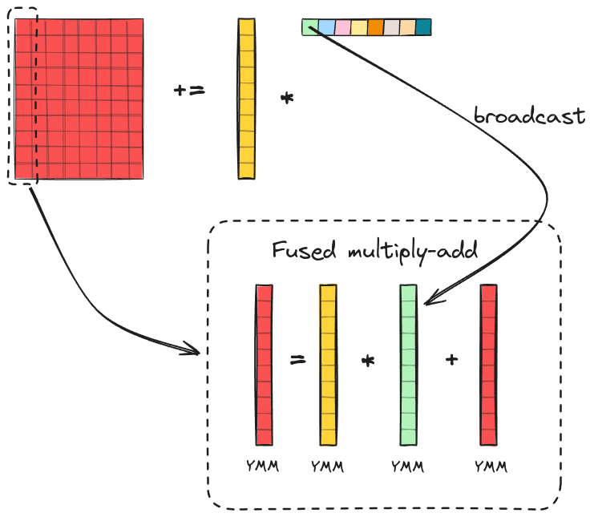
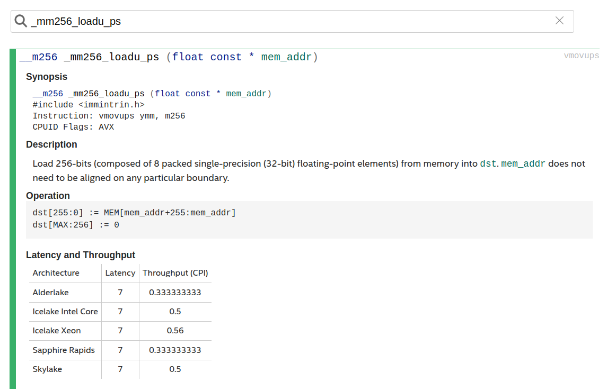
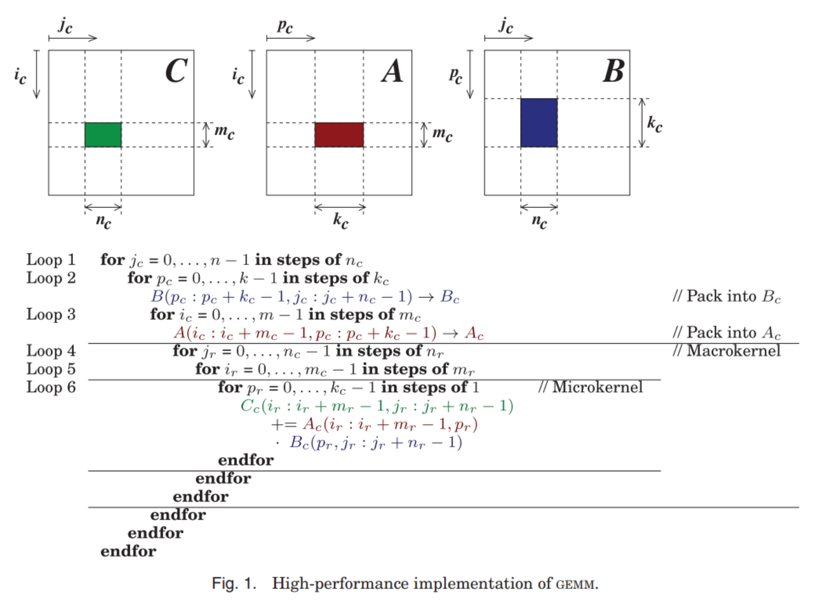
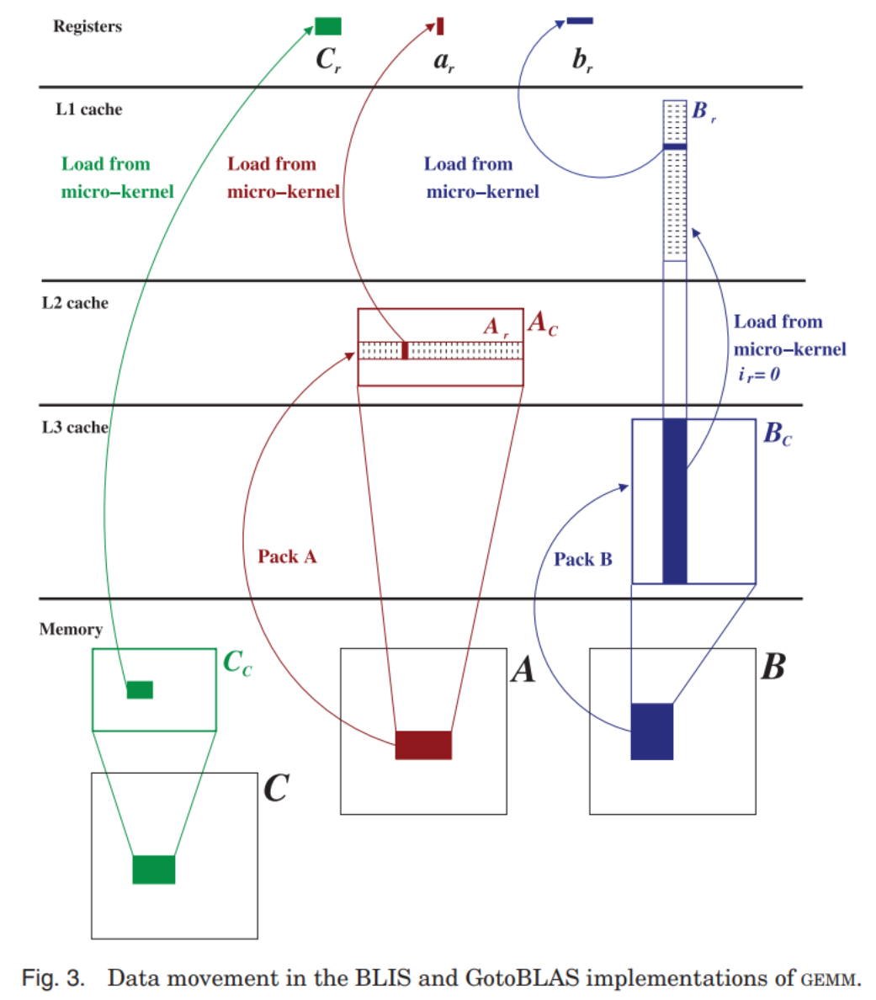

# Current GEMM / GotoBLAS-style Implementation Report

本文说明当前仓库中 GotoBLAS 风格 GEMM 路径的代码结构、数据流和工程边界。参数建模、符号定义以及 \(m_r,n_r,k_c,m_c,n_c\) 的分析见 [BlockedSizeCherche.md](./BlockedSizeCherche.md)。本文只保留实现层面的代码事实。

## 1. Introduction

当前仓库的 GEMM 子系统通过 `MATMUL_IMPL` 在多个后端之间切换。`src/gemm/matmul_dispatch.cpp` 将默认实现解析为 `blas`，即调用 `cblas_sgemm`；只有当运行时把 `MATMUL_IMPL` 设为 `omp_gotoblas_avx2` 或 `omp_gotoblas_avx512`，且 `Matrix::matmul_into` 的两个转置标志都为 `false` 时，调用才会进入 `src/gemm/GEMMGotoBLAS.cpp` 中的自定义路径。`tests/test_gemm_gotoblas_driver.cpp` 与 `tests/test_benchmark_large.cpp` 分别提供当前路径的正确性与测量入口。

## 2. Implementation Overview

公共入口是 `Matrix::matmul_into`。`Matrix` 在 `src/tensor.cpp` / `include/tensor.hpp` 中以 row-major 布局存储，元素索引形式为 `data[r * cols + c]`。`matmul_into` 首先根据 `transA`、`transB` 计算逻辑维度，然后根据 `MATMUL_IMPL` 选择实现。若后端是 `blas`，代码直接调用 row-major `cblas_sgemm`；若后端是自定义实现且 `transA == false && transB == false`，才会落入 `sgemm_ijk`、`sgemm_ikj`、`sgemm_blocked`、`sgemm_omp_*` 或 `sgemm_omp_gotoblas_avx2`。一旦任一输入带转置，自定义 GotoBLAS 风格路径就不会被调用。

`sgemm_omp_gotoblas_avx2` 在进入具体执行路径前检查 `cpu_supports_avx2_fma()`。若当前 CPU 不支持 AVX2/FMA，这条路径直接抛出异常，没有内部的标量 fallback。文件中虽然还暴露了 `sgemm_omp_gotoblas_avx512`，但它当前只是简单转调 `sgemm_omp_gotoblas_avx2`。因此，现有实现仍是 AVX2/FMA 后端，而不是 AVX2 与 AVX-512 两套独立实现。

仓库中有 `tests/test_gemm_microkernels.cpp`、`tests/test_gemm_gotoblas_driver.cpp` 和 `tests/test_gemm_microkernel_benchmark.cpp`。这些文件提供了正确性和测量入口。当前路径支持运行时显式选择 kernel shape 与 blocked-size，但没有自动调参、没有根据 workload 自动切换 kernel family，也没有性能策略层。

## 3. Mapping the Code to the Goto-style Decomposition

`run_gotoblas_fixed` 的外层骨架与 Goto/BLIS 的分层写法是直接对应的。当前默认 micro-kernel shape 为

\[
m_r = 8,\qquad n_r = 8.
\]

最外层 `jc` 循环沿 \(N\) 维推进，形成宽度为 \(n_c\) 的列面板；其内 `pc` 循环沿 \(K\) 维推进，形成宽度为 \(k_c\) 的面板；再内层 `ic` 循环沿 \(M\) 维推进，形成高度为 \(m_c\) 的块。这里的 \(m_c,n_c,k_c\) 由运行时 block-size accessor 提供，而不是在 GotoBLAS 主循环中写死。`run_macro_kernel` 继续以 `jr` 和 `ir` 将 `C_block` 切成 \(n_r\) 宽的微面板和 \(m_r \times n_r\) 的微块，并对每个微块调用当前选择的微内核。

如图 1 所示，Goto/BLIS 文献中的分层分解提供了理解当前 `jc/pc/ic/jr/ir` 循环结构的最直接参照。该图在本文中仅用于说明层次关系与数据复用角色，而不是作为当前实现细节的替代。

*Figure 1. Layered decomposition used as a reference for the `jc/pc/ic/jr/ir` loop hierarchy. Source: repository-local reference figure adapted from the BLIS/Goto-style blocking literature. It is used here to anchor the implementation mapping in this section.*

这说明当前实现确实采用了 Goto 风格的层次分工：packing 负责把原始 row-major 数据改写成面向微内核的顺序访问布局，macro-kernel 负责在 \(m_c,n_c,k_c\) 粒度上组织复用，micro-kernel 只负责寄存器级 \(m_r \times n_r\) 块的更新。若按 Goto 论文的术语来描述，`run_macro_kernel` 的内层组织最接近围绕 `gebp` 的执行方式：固定一个 \(B_r\) 微面板后，多个 \(A_r\) 微面板依次与之相乘并更新对应的 \(C_r\)。

这里也有两个需要明确的实现差异。第一，Goto 论文的表述默认 BLAS 接口是 column-major，而当前仓库从 `Matrix` 到自定义 GEMM 都是 row-major。第二，当前代码只是采用了 Goto/BLIS 式分层 skeleton，并没有对象层、控制树或 kernel registry；因此它不应被写成 BLIS 框架本身的复现。

## 4. Micro-kernel Organization

当前默认微内核为 `avx2_8x8`，由 `microkernel_full_avx2_8x8` 和 `microkernel_fringe_avx2_8x8` 两部分组成。前者处理完整 \(8 \times 8\) tile，后者处理边界 tile。两者都围绕同一个寄存器块展开：八个 `__m256` 累加寄存器分别保存结果块的八行，循环内先从 packed `B` 中读取一个长度为 8 的向量，再从 packed `A` 中广播八个标量，对这八个行寄存器执行 FMA 更新。

如图 2 所示，当前微内核把 \(C_r\) 的八行分别映射到八个 YMM 累加寄存器上；这一寄存器布局直接对应 `microkernel_full_avx2_8x8` 中“加载 \(B_r(p,:)\) 向量、广播 \(A_r(i,p)\) 标量、对每一行执行 FMA”的更新顺序。该图保留在正文中，是因为它直接支撑本节对寄存器组织和向量化方向的说明。

*Figure 2. Register layout of the current 8x8 AVX2 micro-kernel. Source: repository-local custom diagram prepared for this report. It summarizes the row-wise accumulator organization implemented in `microkernel_full_avx2_8x8`.*

就实现结构而言，当前内核是典型的 outer-product / rank-1-update 组织。与 Salykov 教程中的 `16×6` AVX2 kernel 相比，二者都在 \(k\) 维循环中反复做 rank-1 update，都把 `C` 的一个小块保存在寄存器中，都依赖 packed 输入来消除微内核内部的复杂地址访问。差异在于寄存器方向：Salykov 的示例沿 \(m_R\) 方向向量化，当前实现沿 \(n_r\) 方向向量化。参数语义和建模解释见 [BlockedSizeCherche.md](./BlockedSizeCherche.md)。

边界块处理并未退回标量路径。`microkernel_fringe_avx2_8x8` 使用与 full kernel 相同的 FMA 更新公式，只是在寄存器初始化和回写阶段加入边界控制。列尾不足 8 时，代码通过 `_mm256_maskload_ps` / `_mm256_maskstore_ps` 处理有效列；行尾不足 8 时，多余行对应的寄存器直接置零，而 `pack_a_micro_panel` 也会为这些位置写入零。`pack_b_micro_panel` 同样会把不足 \(n_r\) 的尾列补零。因此，当前 fringe 路径是“zero padding + masked SIMD”而不是 scalar fallback。

除默认 `avx2_8x8` 外，当前代码还通过 `MATMUL_GOTO_KERNEL` 支持显式选择 `avx2_12x8`、`avx2_13x8`、`avx2_4x16`、`avx2_5x16` 与 `avx2_6x16`，并接受去掉前缀的短名。`run_selected_microkernel` 对这些 shape 分别调度 full / fringe 微内核。这只是运行时选择机制，不是 workload-aware 自动调参系统；若环境变量缺失或为空，默认仍为 `avx2_8x8`。

## 5. Packing and Data Layout

packing 由 `pack_a_micro_panel`、`pack_b_micro_panel`、`pack_A_block` 和 `pack_B_block` 四层配合完成。`pack_a_micro_panel` 以 \(k\) 为外层、行索引为内层，把 \(A\) 的微面板写成 `packed_A[k * mr + i]`；`pack_b_micro_panel` 以 \(k\) 为外层、列索引为内层，把 \(B\) 的微面板写成 `packed_B[k * nr + j]`。前者把原始 row-major `A` 重组为便于按列流式读取的 panel-major 布局，后者则把原始 row-major `B` 的连续片段重排为以微面板为单位的顺序块。

块级 packing 进一步决定了 buffer 的职责分工。`pack_B_block` 以 `jr` 为单位把一个 \(k_c \times n_c\) 面板拆成若干 \(k_c \times n_r\) 微面板，连续写入 `packed_B`；`pack_A_block` 以 `ir` 为单位把一个 \(m_c \times k_c\) 面板拆成若干 \(m_r \times k_c\) 微面板，连续写入 `packed_A`。`run_macro_kernel` 再用固定的地址公式恢复出当前 `ir/jr` 对应的面板指针并调用微内核。

两个工程细节值得单独指出。其一，`PackedWorkspace` 使用 32 字节对齐分配，保证 packed 缓冲与 AVX2 宽度匹配；而 `C` 的访问仍然采用 `_mm256_loadu_ps` / `_mm256_storeu_ps`，说明外部矩阵本身不需要额外对齐约束。其二，packing 缓冲不是临时栈对象，而是 `thread_local` 工作区的一部分；这避免了热路径上频繁的分配和释放。

## 6. Blocking and Parallel Execution

当前 GotoBLAS 路径的 blocking 不再是主循环内写死常量。`run_gotoblas_fixed` 通过 `current_mc_block_size()`、`current_nc_block_size()` 和 `current_kc_block_size()` 读取运行时生效的 \(m_c,n_c,k_c\)。这些 accessor 支持新环境变量 `MATMUL_MC`、`MATMUL_NC`、`MATMUL_KC`，也兼容 legacy alias `MATMUL_PACK_M`、`MATMUL_PACK_N`、`MATMUL_PACK_K`；若未设置对应变量，则回退到 `MATMUL_BLOCK_SIZE` / 编译期 `BLOCK_SIZE` 的通用默认值。

需要注意的是，这些 accessor 采用 first-observed-value static cache 语义：同一进程中第一次读取到的 \(m_c,n_c,k_c\) 会被缓存，后续再修改环境变量不会改变已缓存的值。因此，测试或 benchmark 若要控制 effective blocking，必须在第一次进入相关 accessor 之前设置环境变量。`gotoblas_default_mc/nc/kc()` 暴露的是实现侧默认信息，不应与主循环当前实际读取的 runtime-effective blocking 混淆。

当前保留的并行策略为 `ic / M` 层并行。`run_gotoblas_fixed` 在 parallel region 外先确保 `packed_B` 的共享工作区容量足够；进入 parallel region 后，每个线程从自己的 `thread_local` 工作区获得私有 `packed_A`。每个 `(jc, pc)` 组合上，`pack_B_block` 位于 `#pragma omp single` 区域，只打包一次，供所有线程共享读取；随后 `#pragma omp for schedule(static)` 按 `ic_block` 切分工作，每个线程对自己负责的 \(A_c\) 调用 `pack_A_block`，再执行 `run_macro_kernel`。

这一组织方式带来的工作集分工是明确的：`packed_A` 是线程私有的，`packed_B` 是共享的；`C` 也按 `ic` 行块切分，因此线程之间没有对同一输出 tile 的写冲突。与 Salykov 教程中按 `jr/ir` 进一步细分并行粒度的写法相比，当前代码把 OpenMP 并行放在 `ic` 层。

## 7. Relation to the Reference Designs

### 7.1 Clearly inherited from Goto / BLIS

当前实现沿用了 Goto/BLIS 的核心分层：packing、macro-kernel 和 micro-kernel 职责分离，外层循环按 `jc/pc/ic/jr/ir` 组织。就结构而言，它明确属于 Goto 风格 GEMM 的分层路线。

### 7.2 Structurally similar but semantically different

与参考设计的相似性主要体现在分层 skeleton 与 outer-product 型微内核组织上，但语义并不完全相同。当前实现仍是 row-major 接口，且当前 AVX2 micro-kernel 与 Salykov 的 `16×6` kernel 在寄存器方向和 packed 面板布局上并不一致。

### 7.3 Clear deviations from the reference routes

当前实现没有 BLIS 那样的对象层和运行时控制树，也没有 OpenBLAS/GotoBLAS 式的策略调度器。它支持显式选择多个 AVX2 micro-kernel shape 与 blocked-size，但这些选择都由环境变量直接指定；`sgemm_omp_gotoblas_avx512` 目前也只是 AVX2 别名，而不是独立实现。

## 8. Engineering Boundaries

当前路径的边界可以从代码直接读出。它只覆盖 `float`、row-major、`transA=false`、`transB=false` 的矩阵乘法；一旦涉及转置，自定义实现就被分发层绕开。它要求 AVX2/FMA 支持，否则直接失败。它支持显式选择若干 AVX2 micro-kernel shape 与 runtime-effective \(m_c,n_c,k_c\)，但这些机制都不是自动调参系统。它有独立的测试和 benchmark harness，但这些 harness 只提供验证和测量入口，不构成任何性能结论。

测试层面，`tests/test_gemm_gotoblas_driver.cpp` 覆盖当前保留的 GotoBLAS baseline 路径，并将输出与朴素参考实现比较。这些测试只提供正确性验证，不构成性能结论。

关于 \(m_r,n_r,k_c,m_c,n_c\) 的建模前提、cache/TLB 近似和适用边界，见 [BlockedSizeCherche.md](./BlockedSizeCherche.md)。实现报告只保留代码可直接确认的工作集事实：`A_c` 为线程私有，`B_c` 为共享工作集，`B_r` 在 `ir` 维复用，fringe 路径采用 masked SIMD。

## 9. Conclusion

`src/gemm/GEMMGotoBLAS.cpp` 实现了一条结构完整的 GotoBLAS 风格 GEMM 路径：它具有显式 packing、清晰的 macro-kernel 层次，以及围绕共享 \(B_c\) 与私有 \(A_c\) 组织的 baseline OpenMP 执行方式。本文因此将其界定为当前仓库中的 Goto 风格 AVX2 后端，而不是 BLIS 或 Salykov 实现的直接移植。

## Appendix: Reference Figures and Screenshots

附录收纳不直接承担正文主线论证的参考材料。它们用于补充背景或帮助读者对照实现细节，但不应被视为代码事实本身。

*Figure A1. Source: Intel Intrinsics Guide, AVX2 documentation, https://www.intel.com/content/www/us/en/docs/intrinsics-guide/index.html#avxnewtechs=AVX2. Used here as a compact reference for the AVX2 intrinsic family employed by the micro-kernel.*

*Figure A2. Source: repository-local schematic based on `src/gemm/GEMMGotoBLAS.cpp` (`run_gotoblas_fixed`). Used here to support the loop-to-code mapping in Section 3.*

*Figure A3. Source: adapted conceptual data-movement reference from the BLIS/GotoBLAS literature. Used here as background for the implementation mapping discussed in Section 3.*

## References

- Kazushige Goto and Robert A. van de Geijn, *Anatomy of High-Performance Matrix Multiplication*. https://www.cs.utexas.edu/~flame/pubs/GotoTOMS_revision.pdf
- Amanzhol Salykov, *How to Optimize a Fast Matrix Multiplication in C on CPU*. https://salykova.github.io/matmul-cpu
