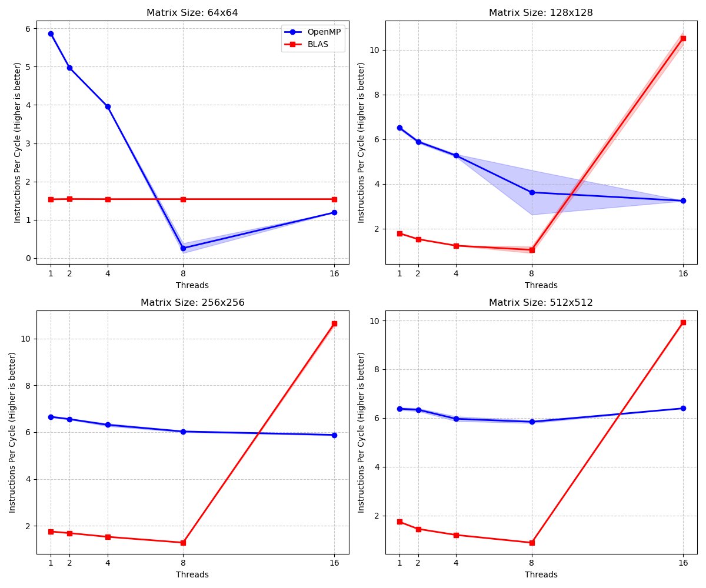

# Guide des Expériences GEMM (Multiplication Matricielle)

## Configuration Expérimentale

### Environnement Matériel

- **Processeur** : AMD Ryzen 9 8940HX (32 cœurs logiques, 16 cœurs physiques)
- **Configuration limitée** : Fixé à 8 cœurs physiques via `taskset -c 0-7`
- **Fréquence CPU** : Verrouillée à 4.0 GHz (mode performance)

### Paramètres de Test

- **Tailles de matrices** : 64×64, 128×128, 256×256, 512×512
- **Nombre de threads** : 1, 2, 4, 8, 16
- **Implémentations** : OpenMP (OMP), OpenBLAS (BLAS)
- **Nombre d'itérations** : 2000 répétitions par configuration

### Protocole de Mesure

- **Warm-up** : 5 itérations avant mesure (préchauffage du cache d'instructions et de données)
- **Mesure temporelle** : Boucle interne de 2000 itérations dans le programme, utilisant `std::chrono`
- **Mesure des compteurs matériels** : Boucle interne de 2000 itérations dans le programme, 3 répétitions externes avec perf (`-r 3`)
- **Isolation de l'environnement** :
  - **Redémarrage** : Entre chaque série de tests (pour réduire l'hétérogénéité de charge de fond)
  - **Cache Page** : Vidé via `drop_caches` avant chaque mesure (pour stabiliser l'allocation mémoire)
  - **Turbo Boost** : Désactivé (pour assurer une fréquence constante de 4.0 GHz)
  - Le warm-up constitue le mécanisme principal de stabilisation du chemin d'exécution (caches/pipeline). Le redémarrage et drop_caches sont utilisés uniquement pour réduire l'hétérogénéité inter-séries liée à l'état global du système.

## Métriques Mesurées

### Métriques Temporelles

- `Time_us` : Temps d'exécution moyen (microsecondes)
- `StdDev_us` : Écart-type du temps
- `GFLOPS` : Milliards d'opérations en virgule flottante par seconde

### Compteurs Matériels (via `perf stat`)

- `Instructions` : Nombre total d'instructions exécutées
- `Cycles` : Nombre de cycles CPU
- `IPC` : Instructions par cycle (Instructions / Cycles)
- `Context Switches` : Nombre de changements de contexte (événement de planification du noyau)
- `CPU Migrations` : Nombre de migrations CPU (événement de planification du noyau)
- `Cache Misses` : Nombre de défauts de cache
- `Cache References` : Nombre total d'accès au cache

**Toutes les métriques incluent l'écart-type** pour évaluer la stabilité des mesures.

**Note** : `context-switches` et `cpu-migrations` sont des événements de planification du noyau (software events), utilisés pour caractériser le comportement de planification et de migration des threads, et non des événements matériels arithmétiques/cache en soi.

---

## Évolution de la Méthodologie de Mesure

### Problème Initial : Context Switches = 0

**Commande initiale** :

```bash
perf stat -e context-switches:u
```

**Résultat** : Toujours 0

**Analyse des raisons** :

La principale raison pour laquelle `context-switches:u` est 0 est que le modificateur `:u` ne compte qu'en mode utilisateur, alors que les changements de contexte sont effectués par le planificateur du noyau en mode noyau. Par conséquent, lorsque l'événement se produit, il ne satisfait pas la condition de comptage `:u`, ce qui entraîne une valeur statistique de 0 ou extrêmement faible. **Ce résultat ne signifie pas que le système n'a pas effectué de changements de planification**.

Une fenêtre de mesure de courte durée (niveau microseconde) entraînera moins d'échantillons statistiques, réduisant davantage la probabilité de capture, mais même dans une fenêtre de longue durée, le modificateur `:u` exclura toujours les événements de planification en mode noyau.

**Figure** : Changement de contexte mesuré avec `:u` (`output/GEMM/BLAS1/hw_metric_cs.png`) (déjà supprimé)

### Compréhension du Modificateur `:u`

**Mode utilisateur (`:u`)** :

- Code C++/Python
- Partie utilisateur de BLAS/OpenMP
- Opérations arithmétiques, boucles, chargement/stockage
- Fonctions de bibliothèque n'utilisant pas de ressources système
- **Exclut** : Les changements de contexte effectués par le planificateur (même pour l'hyperthreading de 16 threads sur 8 cœurs)

**Mode noyau (sans modificateur)** :

- Appels système (`malloc` → `brk`/`mmap`, `printf` → `write`)
- Gestion des interruptions (réseau, disque, timer)
- **Planificateur** : Décisions de planification des threads
- Gestion de la mémoire (défauts de page, TLB)
- **Mécanismes de synchronisation** : `futex`, verrous, réveils de threads

### Solution : Mesure en Mode Noyau

**Événements de mesure mis à jour** :

```bash
perf stat -e context-switches,cpu-migrations
```

**Événements mesurés** :

- `context-switches` : Nombre de fois que le planificateur transfère le CPU à un autre thread
- `cpu-migrations` : Nombre de fois qu'un thread migre d'un CPU à un autre

**Résultat** : Dans cette expérience, cela se manifeste par la capacité de capturer les événements de synchronisation et de planification.

[Note] *Ici, je suppose que mesurer sans `:u` est méthodologiquement raisonnable pour caractériser le coût de planification ; je ne suis pas entièrement sûr que des exécutions très courtes n'introduisent pas d'effets de bord.*

---

## Problème des Cache Misses : Instabilité sur Petites Matrices

### Tentative 1 : Mesure System-Wide des L3 Misses (Abandonnée)

**Commande** :

```bash
sudo perf stat -a -e amd_l3/l3_lookup_state.l3_miss/
```

**Problème** :

- **Paramètre `-a`** : Mesure l'ensemble du système
- **Pollution** : Inclut navigateurs, IDE, démons système, etc.
- **Résultat** : Coefficient de variation jusqu'à **58%** (inutilisable)

**Raison technique** :

`l3_lookup_state.*` appartient au PMU uncore `amd_l3`, ce type d'événement ne supporte pas l'attribution per-task ; par conséquent, même sans spécifier explicitement `-a`, perf collectera cet événement en mode system-wide, avec une sortie marquée comme system wide. `sudo` n'affecte que les permissions (permettant l'accès au PMU uncore), sans changer le modèle d'attribution de ce PMU.

**Position** :

Les événements L3 uncore, en raison de la pollution causée par l'attribution system-wide, ne conviennent pas à la comparaison quantitative dans des fenêtres courtes ; par conséquent, nous utilisons des événements core per-task (`cache-misses`, etc.) dans nos conclusions principales, et utilisons L3 uncore uniquement comme référence de tendance qualitative dans des fenêtres longues.

[Note] *Dans ce document, cache-misses est utilisé comme un signal agrégé de pression mémoire et de perte de localité (comparaisons relatives). Aucune attribution fine (L1/L2/L3) n'est faite à partir de cet événement seul.*

**Figure** : L3 misses system-wide (abandonné) (`output/GEMM/BLAS1/hw_metric_l3_misses_syswide.png`) (déjà supprimé)

### Solution Finale : Cache Misses au Niveau Processus

**Commande** :

```bash
perf stat -e cache-misses,cache-references
```

**Améliorations** :

- [OK] Suppression de `-a` → Mesure uniquement le processus actuel
- [OK] Suppression de `sudo` → Droits utilisateur normaux
- [OK] Événements génériques → Support Intel/AMD
- [OK] Appel unique → Amélioration de l'efficacité

**Nature de `cache-misses`** :

`cache-misses` est un événement générique souvent interprété comme un indicateur agrégé de pression mémoire globale ; aucune attribution à un niveau de cache spécifique n'est supposée.

### Tentative d'Amélioration : Augmentation du Nombre de Répétitions

**Modification** :

```bash
perf stat -r 10 ...  # Augmenté de 3 à 10 répétitions
```

**Figure** : Cache misses au niveau processus (`output/GEMM/BLAS1/cache_misses_vs_threads.png`)


**Observations** :

- BLAS 64×64 petite matrice sélectionne directement mono-thread, en dessous du seuil de parallélisation
- Lorsque la taille augmente, BLAS commence à paralléliser, les cache-misses deviennent visibles avec l'augmentation du nombre de threads ; en même temps, sa variance est faible, indiquant une implémentation plus reproductible.
- OpenMP a du mal à prédire les cache-misses des petits threads pour les matrices moyennes et grandes, et la variance est élevée, indiquant une implémentation instable.

### Analyse du Phénomène : Causes Possibles de la Haute Variance

**Figure** : Coefficient de variation des cache misses (`output/GEMM/BLAS1/cache_cv_vs_threads.png`)


**Observations** :

- Petites matrices : La plupart des variances sont inférieures à 5%
- Grandes matrices : La plupart des variances de BLAS sont inférieures à 5%, mais la variance d'OpenMP devient parfois très élevée, indiquant une implémentation instable.

## Configuration Finale de Mesure

### Commande `perf` Utilisée

```bash
# scripts/ExperiencGEMM/find_optimal_threads.sh
perf stat -x, -r 3 -e instructions,cycles,context-switches,cpu-migrations,cache-misses,cache-references
```

**Caractéristiques** :

- `-x,` : Format CSV, pratique pour l'analyse automatique
- `-r 3` : 3 répétitions externes avec perf, calcul de la variance
- Appel unique : Extraction de tous les indicateurs + variance en une fois
- **Sans modificateur** : Mesure mode utilisateur + mode noyau

**Niveaux de mesure** :

- **Interne au programme** : Boucle de 2000 itérations (fournit une valeur moyenne stable)
- **Externe avec perf** : Exécution répétée 3 fois (fournit une estimation de la variance)

### Format de Sortie CSV

```csv
Implementation,Size,Threads,Time_us,StdDev_us,
Instructions,Instr_StdDev,Cycles,Cycles_StdDev,
IPC,IPC_StdDev,CS,CS_StdDev,CpuMigrations,Mig_StdDev,
CacheMisses,Cache_StdDev,Reps
```

---

## Résultats Expérimentaux

### Temps d'Exécution et IPC

**Figure** : Scalabilité du temps d'exécution et IPC (`output/GEMM/BLAS1/scaling_plot_advanced.png`)


**Observations clés** :

1. **BLAS reste mono-thread sur 64×64**
   - Raison : N'atteint pas le seuil de parallélisation interne
   - Les résultats expérimentaux montrent des performances identiques pour toutes les configurations de threads (~9.4 us)

2. **Surcoût d'hyperthreading (16 threads sur 8 cœurs)**
   - OMP : Effondrement des performances (64×64 passe de 8.97 us à 73.00 us, **dégradation de 8.1×**)
   - BLAS : Anomalies sur matrices moyennes et grandes (nombre d'instructions explose de 57-245 fois)

### Context Switches : Le Vrai Coût de l'Hyperthreading

**Découverte la plus importante** : La configuration 16 threads (hyperthreading) entraîne une explosion des changements de contexte

**Figure** : Context switches vs nombre de threads (`output/GEMM/BLAS1/context_switches_vs_threads.png`)


**Découvertes clés** :

1. **Validation de la mesure réussie** : Sans modificateur `:u`, capture avec succès les événements de planification en mode noyau
2. **Catastrophe de l'hyperthreading** : 16 threads sur 8 cœurs entraînent **plus de 90 000** changements de contexte (petites matrices)
3. **Effet de taille** : Les grandes matrices ont un temps de calcul plus long, le taux de changement par unité de temps est relativement réduit, mais le nombre absolu reste énorme

**Impact sur les performances** :

- OMP 64×64, 16 threads : 89 617 CS → temps passe de 8.97 us à 73.00 us (**dégradation de 8.1×**)
- Les changements de contexte s'accompagnent généralement de destruction de la localité du cache, de perte d'état du pipeline et d'augmentation de la pression sur le TLB, amplifiant ainsi significativement les coûts de mémoire et de planification

### CPU Migrations : Modèles de Migration des Threads

**Figure** : CPU migrations vs nombre de threads (`output/GEMM/BLAS1/cpu_migrations_vs_threads.png`)


**Impact** :

- Avec la configuration 16 threads, le nombre de migrations CPU est dans la plage **12K-20K**
- Chaque migration est cohérente avec :
  - Une réduction de la réutilisation des caches privés (L1/L2)
  - Une perte potentielle de localité TLB/prefetcher
  - Une augmentation de la latence d'accès mémoire pour le thread
- C'est un **indice cohérent** avec la haute variance des `cache-misses`

### Cache Misses : Analyse de Variance et Validation d'Hypothèse

**Voir les graphes précédents** :

- `cache_misses_vs_threads.png` (Valeurs absolues des Cache Misses)
- `cache_cv_vs_threads.png` (Coefficient de variation des Cache Misses)

**Observations clés** (exemple OMP 64×64) :

1. **Explosion des Cache Misses** : 16 threads est **6.7 fois** plus que 8 threads
2. **Réduction anormale de la variance** : Le coefficient de variation passe de 1.9% à 0.5%
3. **Explosion de la planification** : Context switches passent de 7 à 89 617

**Explication** :

- Les CS élevés entraînent des invalidations fréquentes du cache, mais c'est un **comportement déterministe** (mode d'attente passive)
- La variance faible est due à la stabilité du modèle de planification, le comportement de planification est similaire à chaque exécution
- Cela **soutient nettement l'hypothèse de planification/migration comme explication dominante dans les conditions mesurées**, plutôt qu'un simple false sharing

**Tendances du coefficient de variation** :

- Petites matrices (64×64, 128×128) : CV < 4% pour 2/4/8 threads, stable
- Grandes matrices (512×512) : CV dans la plage 8-13%, significativement plus élevé que les petites matrices
- Indique que les grandes matrices ont **des sources d'incertitude supplémentaires** (possiblement compétition de bande passante mémoire, effets NUMA)

### Résultats de Validation d'Hypothèse

#### Hypothèse de Planification/Migration : Fort Soutien

**Preuves** :

1. **Explosion des Context Switches** : La configuration 16 threads atteint 89K-96K
2. **CPU Migrations significatives** : 12K-20K migrations
3. **Cache Misses corrélés avec CS** : Lorsque CS augmente, cache misses augmente de manière synchrone
4. **Variance anormale des petites matrices** : Le CV de 16 threads diminue (planification déterministe)

**Conclusion** : La planification et la migration sont plus probablement le **facteur principal** de la haute variance des cache misses, en particulier dans les configurations d'hyperthreading.

[Note] *Cette attribution est basée sur une corrélation forte (CS, migrations, cache misses). Je n'ai pas encore conçu d'expérience de contrôle permettant d'exclure formellement d'autres causes (false sharing, contention mémoire, etc.).*

### Compteurs Matériels

**Figure** : Nombre total d'instructions (`output/GEMM/BLAS1/hw_metric_instructions.png`)


**Observations** :

- OMP : Augmentation linéaire avec le nombre de threads (coût des instructions de synchronisation)
- BLAS : Relativement stable (instructions SIMD optimisées)
- **Anomalie** : BLAS 16 threads sur matrices 128/256/512, le nombre d'instructions explose de 57-245 fois
  **Priorité des causes possibles** :
  - Peut provenir des instructions de spin-wait (PAUSE, etc.) comptées (beaucoup d'instructions à faible coût gonflent l'IPC)
  - L'attente active multi-threads fausse l'IPC (IPC élevé ≠ calcul effectif)

**Figure** : Cycles CPU (`output/GEMM/BLAS1/hw_metric_cycles.png`)


**Observations** :

- Diminue avec l'augmentation du parallélisme (jusqu'à 8 threads)
- Augmente à 16 threads (contention et coût de planification)

**Figure** : Instructions par cycle (IPC) (`output/GEMM/BLAS1/hw_metric_ipc.png`)



**Observations** :

- BLAS : IPC élevé (1.3-1.8, pipeline saturé)
- OMP : IPC moyen (3.3-6.7, inclut instructions de synchronisation)
- **Anomalie** : BLAS 16 threads IPC > 10
  **Interprétation** : IPC anormalement élevé, indiquant que "instructions retired / cycles" n'est plus un proxy du travail utile (forte probabilité de surreprésentation d'instructions de synchronisation/spin-wait et d'effets de contention SMT).

**Clarification de définition** :

Il faut noter que l'IPC reflète ici les instructions retired per cycle, et non le débit de calcul effectif.

[Note] *Je ne suis pas sûr que l'IPC soit un indicateur pertinent ici ; je le conserve surtout comme signal d'anomalie plutôt que comme métrique de performance.*

### Phénomène Important : Instruction PAUSE

**Observation** :

Pendant les phases d'attente active, en particulier l'instruction `PAUSE` utilisée dans les mécanismes de synchronisation, **est comptée comme une instruction exécutée**.

**Conséquences** :

- Augmente l'IPC apparent
- **Ne produit aucun calcul réel**
- Peut masquer les vraies performances

**Exemple** :

```cpp
// Spin-wait dans OpenMP
while (!ready) {
    _mm_pause();  // Comptée comme instruction
}
```

### Analyse Approfondie du Spin-Wait (Anomalie BLAS 16 threads)

#### Énoncé du Problème

BLAS 16 threads présente une explosion du nombre d'instructions sur les matrices 128/256/512 :

| Matrice | Instructions 8 threads | Instructions 16 threads | Multiplicateur |
| ------ | ------------ | ------------- | ------ |
| 128×128 | 1.74B | 438.68B | 252× |

**Question clé** : Pourquoi l'hyperthreading entraîne-t-il une explosion des instructions ? S'agit-il d'instructions « inutiles » ?

**Hypothèse** : Les instructions « supplémentaires » ne sont pas magiques ; il s'agit d'un **surcoût de synchronisation fixe** réparti sur un volume de calcul trop faible. La métrique pertinente est donc **Instr/Op** (instructions par opération).

#### Conception Expérimentale

**Expérience A :** Effet de la taille de matrice (coût unitaire)

- Objectif : Prouver que l'explosion des instructions vient d'un **surcoût relatif** élevé.
- Méthode : Calculer **Instr/Op** et comparer différentes tailles.
- Attendu : Si N=128 a un Instr/Op beaucoup plus élevé que N=1024, le surcoût fixe domine.

**Expérience B :** Affinité CPU et planification

- Objectif : Montrer que la **contension de planification** est la cause principale.
- Méthode : Comparer **planification par défaut** vs **liaison stricte**.
- Remarque : `taskset` limite les cœurs disponibles, mais **ne fixe pas** les threads ; `OMP_PROC_BIND` fixe les threads sur des cœurs physiques.
- Attendu : Si la liaison réduit fortement CS et Instructions, la planification est la cause.

**Expérience C (complément) :** Effet de fenêtre sur la stabilité

- Objectif : Vérifier si les mesures instables se stabilisent avec une fenêtre plus longue.
- Méthode : Comparer 500 vs 2000 itérations.

#### Résultats Expérimentaux des expériences

**Expérience A :** Effet de la taille (Instr/Op)

| Taille | Instructions totales | Instr/Op (approx.) | Conclusion |
| --------- | --------- | ---------------- | --- |
| 128×128 | 438.68B | **0.587** (très élevé) | **Surcoût dominant** |
| 1024×1024 | 132.59B | **0.128** (normal) | **Calcul dominant** |

**Interprétation** : Le coût unitaire (Instr/Op) de 128×128 est ~4.5× plus élevé ; le surcoût fixe de synchronisation est donc **amplifié** sur petites matrices.

**Expérience B :** Planification vs Affinité (128×128, 5000 iters)

| Indicateur | Config A (libre) | Config B (affinité) | Variation |
| :--- | :--- | :--- | :--- |
| **Context Switches** | 2,013 (et plus) | **14** | **-99.3%** |
| **Instructions** | 13.45B | 4.05B | **-69.9%** |
| **Cache Misses StdDev%** | 1.32% | **0.06%** | **~22× plus stable** |

**Conclusion** : La contension de planification est la cause principale ; la liaison réduit drastiquement CS et instructions.

**Expérience C :** Fenêtre de stabilité

| Fenêtre | CV (Instr) | État |
| :--- | :--- | :--- |
| **500 iters** | 30.34% | **Instable** |
| **2000 iters** | 1.44% | **Stable** |

**Conclusion** : Forte variabilité à court terme, mais stabilisation à la fenêtre standard (2000).

#### Synthèse Diagnostique

1. **Taille trop petite** : calcul très court → synchronisation dominante (Instr/Op élevé).
2. **Trop de threads** : 16 threads sur 8 cœurs → contension de planification.
3. **Boucle de rétroaction** : CS/migrations prolongent l'attente → instructions inutiles.
4. **Variabilité** : instable à court terme, stable à fenêtre standard.

### Re-test avec Affinité CPU : Comparaison des Performances

**Prescription** : Utiliser `OMP_PROC_BIND=true` pour fixer le comportement OpenMP interne de BLAS, afin d'ancrer les threads sur des cœurs physiques et éviter les migrations à 16 threads.

**Figure** : Comparaison des performances par taille de matrice (`output/GEMM/BLAS2/scaling_plot_advanced.png`)


**Conclusions clés** :

| Taille de Matrice | Configuration Optimale | Performance (μs) | Comparé au Mono-thread |
|-------------------|------------------------|------------------|------------------------|
| 64×64             | BLAS mono-thread       | 9.42             | -                      |
| 128×128           | BLAS 8 threads         | 24.29            | Accélération 3.5×      |
| 256×256           | BLAS 8 threads         | 123.75           | Accélération 5.0×      |
| 512×512           | BLAS 8 threads         | 1428.53          | Accélération 3.3×      |

**Observations** :

1. **64×64** : BLAS toutes configurations de threads ont les mêmes performances (~9.4 μs), multi-threading sans bénéfice
2. **128-512** : BLAS 8 threads optimal, 16 threads présente des anomalies (explosion du nombre d'instructions)
3. **OMP 16 threads** : Dégradation significative sur toutes les tailles (coût de l'hyperthreading)
4. **BLAS vs OMP** : BLAS significativement supérieur à OMP dans toutes les configurations (accélération 3.9-5.0×)

---

## Préparer l'Environnement Expérimental

```bash
# 1. Vérifier le gouverneur actuel
cpupower frequency-info

# 2. Passer en mode 'performance'
sudo cpupower frequency-set -g performance

# 3. Verrouiller à 4 GHz (expériences rigoureuses)
# Attention : assurez-vous du refroidissement et du support CPU
sudo cpupower frequency-set -u 4000MHz -d 4000MHz

# 4. Vérifier la fréquence
cpupower frequency-info | grep "current CPU frequency"

# Vider le cache page (réduire la variabilité d'allocation mémoire)
sync; echo 3 | sudo tee /proc/sys/vm/drop_caches

# Désactiver Turbo Boost (chemin AMD/générique validé)
echo "Turbo Boost Status Before:"
cat /sys/devices/system/cpu/cpufreq/boost

if [ -f /sys/devices/system/cpu/cpufreq/boost ]; then
    echo 0 | sudo tee /sys/devices/system/cpu/cpufreq/boost
    echo "Turbo Boost Status After (Should be 0):"
    cat /sys/devices/system/cpu/cpufreq/boost
else
    echo "Warning: /sys/devices/system/cpu/cpufreq/boost not found"
fi
```

## Lancer les Tests

```bash
# Depuis la racine du projet
sudo taskset -c 0-7 bash scripts/ExperiencGEMM/find_optimal_threads.sh
```

**Résultats** : `output/thread_scaling.csv`

## Générer les Graphiques

```bash
# Graphiques de scalabilité
python3 scripts/ExperiencGEMM/plot_scaling.py

# Graphiques des métriques matérielles
python3 scripts/plot_metrics.py
```

**Graphiques générés** :

- `output/GEMM/hw_metric_ipc.png` : Instructions par cycle (IPC)
- `output/GEMM/hw_metric_instructions.png` : Nombre total d'instructions
- `output/GEMM/hw_metric_cycles.png` : Cycles CPU
- `output/GEMM/context_switches_vs_threads.png` : Changements de contexte (2×2)
- `output/GEMM/cache_misses_vs_threads.png` : Défauts de cache (2×2, avec variance)
- `output/GEMM/cache_cv_vs_threads.png` : Coefficient de variation des défauts de cache (2×2)
- `output/GEMM/cpu_migrations_vs_threads.png` : Migrations CPU (2×2)

---

## Conclusions et Recommandations

### Pour Matrices 28×28 (Projet MNIST)

**Recommandation** : **BLAS mono-thread**

**Raisons** :

1. Taille trop petite pour bénéficier du parallélisme
2. Surcoût de synchronisation > gain de calcul
3. BLAS optimisé (SIMD) domine même en mono-thread

### Pour Matrices Moyennes (256×256 - 512×512)

**Recommandation** : **8 threads**

**Raisons** :

1. Bon compromis gain/stabilité
2. Évite l'hyperthreading
3. Réduit les coûts de synchronisation/planification

### Pour Grandes Matrices (≥ 1024×1024)

**Recommandation** : **Nombre de cœurs physiques (8)**

**Raisons** :

1. Le calcul domine la synchronisation
2. Utilisation maximale des ressources
3. Évite la contention de l'hyperthreading

---

## Leçons Méthodologiques

### 1. Comprendre les Modificateurs `perf`

- `:u` exclut les événements noyau → **Invalide pour context-switches** (événement se produit en mode noyau)
- Sans modificateur → Mesure complète (mode utilisateur + mode noyau)

### 2. Uncore PMU vs Core PMU

- **Uncore** (L3) : System-wide uniquement, pollué par d'autres processus, adapté à l'analyse qualitative de fenêtres longues
- **Core** (cache-misses) : Par processus, adapté à la comparaison quantitative, mais signification précise dépend de l'architecture

### 3. Variance comme Indicateur

- **Haute variance** : Phénomène non déterministe (planification, migration, contention de cache)
- **Basse variance** : Mesure fiable, comportement stable

### 4. Petites Matrices ≠ Grandes Matrices

- **Petites matrices** : Synchronisation/planification domine, variance élevée
- **Grandes matrices** : Calcul domine, variance faible

### 5. Inférence Causale Nécessite des Preuves

- Un seul indicateur ne peut pas attribuer de manière unique
- Nécessite la combinaison de plusieurs indicateurs (planification, migration, cache)
- Nécessite des expériences de contrôle pour valider les hypothèses

---

## Restaurer l'Environnement

```bash
# Restaurer le CPU en mode powersave
sudo cpupower frequency-set -g powersave
sudo cpupower frequency-set -d 421MHz -u 5386MHz

# Restaurer perf_event_paranoid (optionnel)
sudo sysctl -w kernel.perf_event_paranoid=2
```

---

## Références

- [Documentation perf](https://perf.wiki.kernel.org/)
- [AMD Performance Monitoring](https://developer.amd.com/resources/developer-guides-manuals/)
- [Événements perf du noyau Linux](https://www.kernel.org/doc/html/latest/admin-guide/perf-security.html)
