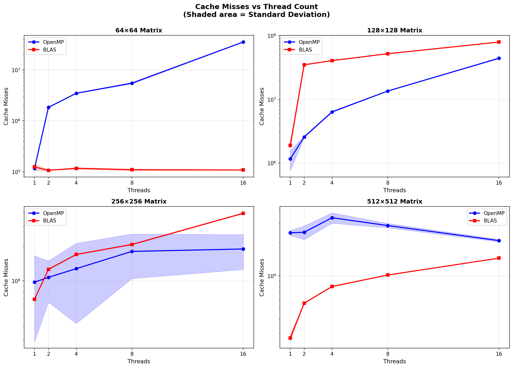
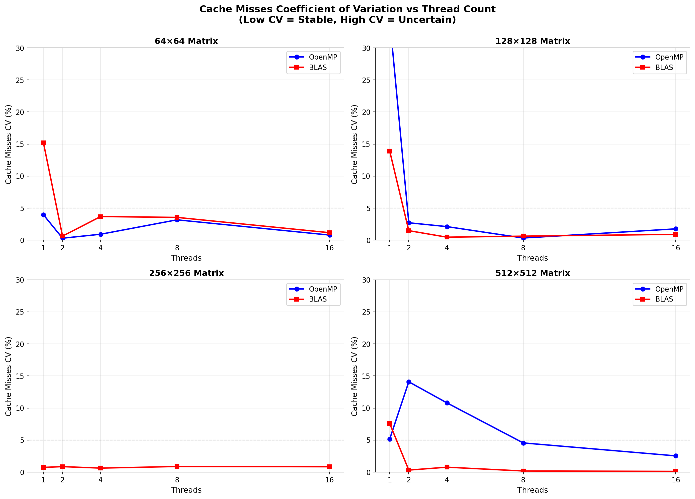
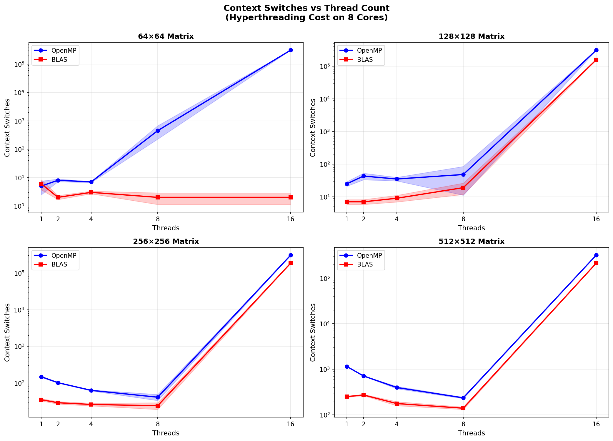
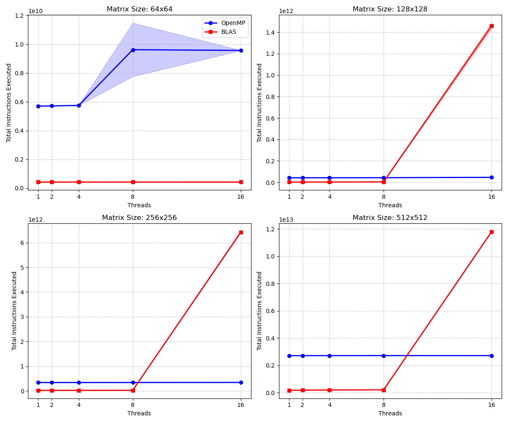
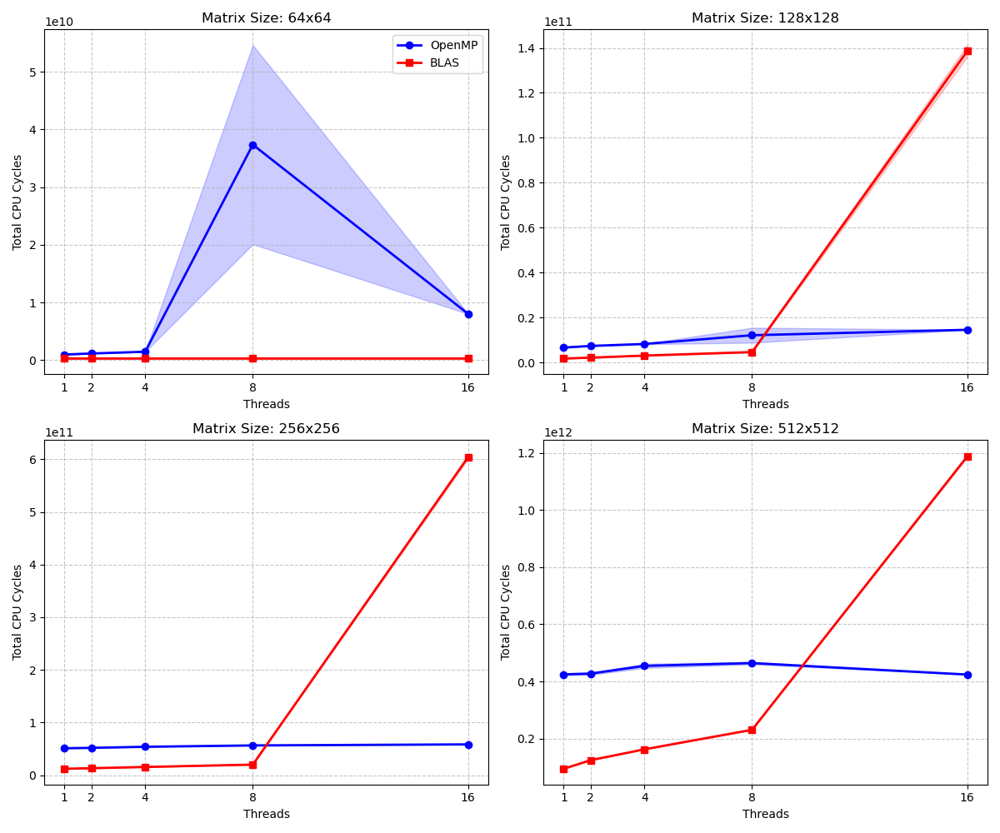
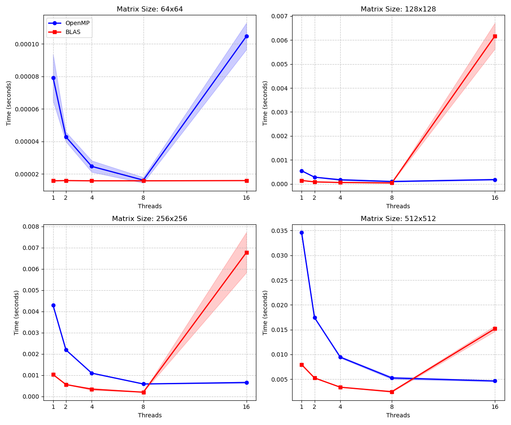

# GEMM 实验指南（矩阵乘法）

## 实验配置

### 硬件环境

- **处理器**：AMD Ryzen 9 8940HX（32 个逻辑核心，16 个物理核心）
- **限制配置**：通过 `taskset -c 0-7` 固定到 8 个物理核心
- **CPU 频率**：锁定在 4.0 GHz（性能模式）

### 测试参数

- **矩阵尺寸**：64×64、128×128、256×256、512×512
- **线程数量**：1、2、4、8、16
- **实现方式**：OpenMP (OMP)、OpenBLAS (BLAS)
- **迭代次数**：每个配置 2000 次重复

### 测量协议

- **预热（Warm-up）**：测量前 5 次迭代（预热指令缓存和数据缓存）
- **时间测量**：程序内部循环 2000 次迭代，使用 `std::chrono`
- **硬件计数器测量**：程序内部循环 2000 次迭代，perf 外部重复 3 次（`-r 3`）
- 鉴于单次运行内部已包含 2000 次迭代以降低测量噪声，对于系统行为重复性较高的稳定配置，perf -r 3 提供了足够的重复性评估。
- **环境隔离**：
  - **每一组重启**：每组测试之间重启计算机（减少后台负载异质性）
  - **清空页缓存**：每次测量前执行 `drop_caches`（减少内存分配波动）
  - **关闭 Turbo Boost**：确保频率恒定在 4.0 GHz（消除频率动态调整干扰）
  - 预热是稳定执行路径（缓存/流水线）的主要机制。每一组重启和清空页缓存仅用于减少与系统整体状态相关的组间异质性。

## 测量指标

### 时间指标

- `Time_us`：平均执行时间（微秒）
- `StdDev_us`：时间标准差
- `GFLOPS`：每秒十亿次浮点运算

### 硬件计数器（通过 `perf stat`）

- `Instructions`：执行的指令总数
- `Cycles`：CPU 周期数
- `IPC`：每周期指令数（Instructions / Cycles）
- `Context Switches`：上下文切换次数（内核调度事件）
- `CPU Migrations`：CPU 迁移次数（内核调度事件）
- `Cache Misses`：缓存未命中次数
- `Cache References`：缓存访问总数

**所有指标均包含标准差**，用于评估测量的稳定性。

**注**：`context-switches` 和 `cpu-migrations` 为内核调度事件（software events），用于表征调度与线程迁移行为，而非算术/缓存硬件事件本身。

---

## 测量方法学的演进

### 初始问题：Context Switches = 0

**初始命令**：

```bash
perf stat -e context-switches:u
```

**结果**：始终为 0

**原因分析**：

`context-switches:u` 为 0 的主要原因是 `:u` 修饰符仅在用户态计数，而上下文切换由内核调度器在内核态完成，因此事件在发生时不满足 `:u` 的计数条件，导致统计值为 0 或极小。**该结果不代表系统未发生调度切换**。

短时间测量窗口（微秒级）会导致统计样本更少，进一步降低捕获概率，但即使在长时间窗口下，`:u` 修饰符仍会排除内核态的调度事件。

**图表**：上下文切换（`:u` 用户态）`output/ExperienceGEMM/BLAS1/hw_metric_cs.png`（已删除）

### 理解 `:u` 修饰符

**用户态（`:u`）**：

- C++/Python 代码
- BLAS/OpenMP 的用户态部分
- 算术运算、循环、加载/存储
- 不使用系统资源的库函数
- **排除**：调度器执行的上下文切换（即使是 16 线程在 8 核心上的超线程）

**内核态（无修饰符）**：

- 系统调用（`malloc` → `brk`/`mmap`，`printf` → `write`）
- 中断处理（网络、磁盘、定时器）
- **调度器**：线程调度决策
- 内存管理（缺页异常、TLB）
- **同步机制**：`futex`、锁、线程唤醒

### 解决方案：内核态测量

**测量事件更新为**：

```bash
perf stat -e context-switches,cpu-migrations
```

**测量事件**：

- `context-switches`：调度器将 CPU 转交给另一个线程的次数
- `cpu-migrations`：线程从一个 CPU 迁移到另一个 CPU 的次数

**结果**：在本实验中表现为能够捕获同步和调度事件。

[注意] *此处我假设不带 `:u` 的测量在方法学上是合理的，用于刻画调度成本；但我不完全确定极短执行时间不会引入边界效应。*

---

## Cache Misses 问题：小矩阵上的不稳定性

### 尝试 1：L3 Misses 系统级测量（已被放弃）

**命令**：

```bash
sudo perf stat -a -e amd_l3/l3_lookup_state.l3_miss/
```

**问题**：

- **`-a` 参数**：测量整个系统
- **污染**：包含浏览器、IDE、系统守护进程等
- **结果**：变异系数高达 **58%**（无法使用）

**技术原因**：

`l3_lookup_state.*` 属于 `amd_l3` uncore PMU，该类事件不支持 per-task 归因；因此即使未显式指定 `-a`，perf 也会以 system-wide 方式采集该事件，输出标记为 system wide。`sudo` 仅影响权限（允许访问 uncore PMU），不改变该 PMU 的归因模型。

**立场说明**：

Uncore L3 事件由于 system-wide 归因带来的污染，在短窗口下不适合用于定量比较；因此我们在主要结论中使用 per-task 的 core 事件（`cache-misses` 等），将 uncore L3 仅作为长窗口下的定性趋势参考。

[注意] *在本文档中，cache-misses 仅作为内存压力和局部性丢失的聚合信号（用于相对比较）。不能仅凭此单一事件做精细的层级归因（L1/L2/L3）。*

**图表**：L3 misses 系统级（已放弃）`output/ExperienceGEMM/BLAS1/hw_metric_l3_misses_syswide.png`（已删除）

### 最终方案：进程级 Cache Misses

**命令**：

```bash
perf stat -e cache-misses,cache-references
```

**改进**：

- [OK] 移除 `-a` → 仅测量当前进程
- [OK] 移除 `sudo` → 普通用户权限
- [OK] 通用事件 → 支持 Intel/AMD
- [OK] 单次调用 → 提高效率

**`cache-misses` 的性质**：

`cache-misses` 是一个通用事件，常被解读为全局内存压力的聚合指标；不能仅凭此单一事件假定对特定缓存层级的归因。

**图表**：进程级 cache misses `output/ExperienceGEMM/BLAS1/cache_misses_vs_threads.png`



**观察**：

- BLAS 64x64 小矩阵是直接选择单线程，不到并行阈值
- 当尺寸变大后，BLAS 开始并行，cache-misses 随线程数增加变得可见；同时其方差小，说明实现更可重复。
- OpenMP难以预测中大矩阵的小线程的 cache-misses，且方差大，说明实现不稳定。

### 现象分析：高方差的可能原因

**图表**：cache misses 变异系数 `output/ExperienceGEMM/BLAS1/cache_cv_vs_threads.png`



**观察**：

- 小矩阵：大部分方差小于5%
- 大矩阵：BLAS的大部分方差小于5%，但是OpenMP的方差有时变得非常大，说明实现不稳定。

## 最终测量配置

### 使用的 `perf` 命令

```bash
# scripts/ExperienceGEMM/find_optimal_threads.sh
perf stat -x, -r 3 -e instructions,cycles,context-switches,cpu-migrations,cache-misses,cache-references
```

**特点**：

- `-x,`：CSV 格式，便于自动解析
- `-r 3`：perf 外部重复 3 次，计算方差
- 单次调用：一次性提取所有指标 + 方差
- **无修饰符**：测量用户态 + 内核态

**测量层次**：

- **程序内部**：循环 2000 次迭代（提供稳定的平均值）
- **perf 外部**：重复运行 3 次（提供方差估计）

### CSV 输出格式

```csv
Implementation,Size,Threads,Time_us,StdDev_us,
Instructions,Instr_StdDev,Cycles,Cycles_StdDev,
IPC,IPC_StdDev,CS,CS_StdDev,CpuMigrations,Mig_StdDev,
CacheMisses,Cache_StdDev,Reps
```

---

## BLAS多线程实验结果

### 执行时间和 IPC

**图表**：执行时间和 IPC 扩展性 `output/ExperienceGEMM/BLAS1/scaling_plot_advanced.png`


**关键观察**：

1. **BLAS 在 64×64 上保持单线程**
   - 原因：未达到内部并行化阈值
   - 实验结果中所有线程配置性能相同（~9.4 us）

2. **超线程开销（16 线程在 8 核心上）**
   - OMP：性能崩溃（64×64 从 8.97 us 降至 73.00 us，**8.1倍降级**）
   - BLAS：中大矩阵出现异常（指令数暴增 57-245 倍，方差过大，表示输出不稳定）

### Context Switches：超线程的真实代价

**最重要的发现**：16 线程配置（超线程）导致上下文切换暴增

**图表**：Context Switches vs 线程数 `output/ExperienceGEMM/BLAS1/context_switches_vs_threads.png`


**关键发现**：

1. **测量成功验证**：无 `:u` 修饰符成功捕获了内核态调度事件
2. **超线程灾难**：16 线程在 8 核心上导致 **9万次+** 上下文切换（小矩阵）
3. **尺寸效应**：大矩阵的计算时间更长，单位时间内的切换率相对降低，但绝对数量仍然巨大

**性能影响**：

- OMP 64×64, 16 线程：89,617 次 CS → 时间从 8.97 us 增至 73.00 us（**8.1倍降级**）
- 上下文切换通常会伴随缓存局部性破坏、流水线状态丢失以及 TLB 压力的增加，从而显著放大内存与调度开销

### CPU Migrations：线程迁移模式

**图表**：CPU Migrations vs 线程数 `output/ExperienceGEMM/BLAS1/cpu_migrations_vs_threads.png`


**影响**：

- 16 线程配置下，CPU 迁移数量在 **12K-20K** 范围
- 每次迁移与以下效应是**相洽的** (is consistent with)：
  - 私有缓存 (L1/L2) 的重用率降低
  - TLB/预取器局部性的潜在损失
  - 线程内存访问延迟增加
- 这与 `cache-misses` 的高方差观察结果是**相洽的**

### Cache Misses：方差分析与假说验证

**参见前文图表**：

- `cache_misses_vs_threads.png`（Cache Misses 绝对值）
- `cache_cv_vs_threads.png`（Cache Misses 变异系数）

**关键观察**（以 OMP 64×64 为例）：

1. **Cache Misses 暴增**：16 线程是 8 线程的 **6.7倍**
2. **方差反常降低**：变异系数从 1.9% 降至 0.5%
3. **调度暴增**：Context switches 从 7 增至 89,617

**解释**：

- 高 CS 导致缓存频繁失效，但这是**确定性行为**（被动等待模式）
- 方差低是因为调度模式稳定，每次运行的调度行为相似
- 这**显著支持调度/迁移假说作为当前测量条件下的主导解释**，而非单纯的 false sharing

**变异系数趋势**：

- 小矩阵（64×64, 128×128）：2/4/8 线程的 CV < 4%，稳定
- 大矩阵（512×512）：CV 在 8-13% 范围，显著高于小矩阵
- 说明大矩阵有**额外的不确定性来源**（可能是内存带宽竞争、NUMA 效应）

### 假说验证结果

#### 调度/迁移假说：强支持

**证据**：

1. **Context Switches 暴增**：16 线程配置达到 89K-96K
2. **CPU Migrations 显著**：12K-20K 次迁移
3. **Cache Misses 与 CS 相关**：CS 增加时 cache misses 同步增加
4. **小矩阵方差反常**：16 线程的 CV 降低（确定性调度）

**结论**：调度和迁移更可能是 cache misses 高方差的**主要因素**，尤其在超线程配置下。

[注意] *该归因基于强相关性（CS、migrations、cache misses），尚未设计对照实验以形式上排除其他原因（false sharing、内存争用等）。*

### 硬件计数器

**图表**：指令数统计 `output/ExperienceGEMM/BLAS1/hw_metric_instructions.png`



**观察**：

- OMP：随线程数线性增加（同步指令开销）
- BLAS：相对稳定（优化的 SIMD 指令）
- **异常**：BLAS 16 线程在 128/256/512 矩阵时指令数暴增 57-245 倍
  **可能原因优先级**：
  - 可能由自旋等待指令（如 PAUSE）被计入导致（大量低成本指令抬高 IPC）
  - 多线程自旋等待导致 IPC 指标失真（高 IPC 不代表有效计算）

**图表**：CPU 周期数 `output/ExperienceGEMM/BLAS1/hw_metric_cycles.png`



**观察**：

- 随并行度增加而减少（直到 8 线程）
- 16 线程时反而增加（竞争和调度开销）

**图表**：每周期指令数 (IPC) `output/ExperienceGEMM/BLAS1/hw_metric_ipc.png`


**观察**：

- BLAS：高 IPC（1.3-1.8，流水线饱和）
- OMP：中等 IPC（3.3-6.7，包含同步指令）
- **异常**：BLAS 16 线程 IPC > 10
  **解读**：IPC 异常过高，说明 "instructions retired / cycles" 已不再是有效工作的代理指标（极大概率是同步/自旋等待指令的过度表达以及 SMT 争用效应）。

**定义澄清**：

需要注意的是，IPC 在此处反映的是 instructions retired per cycle，而非有效计算吞吐。

[注意] *我不确定 IPC 在这里是否是合适的性能指标；更多把它当作异常信号而非性能度量。*

### 自旋等待深度分析 (BLAS 16线程异常)

#### 问题陈述

BLAS 16线程在128/256/512矩阵时出现指令数暴增和方差过大的现象:

| 矩阵 | 8线程指令数 | 16线程指令数 | 倍增 |
| ------ | ------------ | ------------- | ------ |
| 128×128 | 1.74B | 438.68B | 252× |

**核心疑问**: 为什么仅仅是使用了超线程，指令数会暴增252倍？这难道全是无效指令吗？

**假设**: 并非指令“凭空产生”，而是**固定的同步开销**被分摊到了**极小的计算工作量**上。即：单位操作的指令成本 (Instr/Op) 激增。

#### 实验设计

为了回答这个问题，我们进行两个核心验证实验：

**实验A:** 矩阵规模对比 (固定开销占比)

- 目标: 证明 "指令数暴增" 的本质是 **同步开销占比 (Overhead Ratio)** 过高。
- 方法: 计算 "单位操作指令数" (Instr/Op)，对比不同矩阵尺寸。
- 预期: 若 N=128 的单位开销显著高于 N=1024，说明固定开销(同步)占主导。

**实验B:** CPU亲和性与调度影响

- 目标: 证明 "不绑定核心" 导致的调度争抢是性能恶化的根源。
- 方法: 对比 **默认调度** (允许线程在核间漂移) vs **严格绑定** (使用 `OMP_PROC_BIND=true OMP_PLACES=cores`)。
- 注意: `taskset` 仅限制进程可用的核心范围，而 `OMP_PROC_BIND` 强制将每个线程固定在特定核心上，防止核内争抢。
- 预期: 绑定核心后，如果指令数和 CS 恢复正常，则实锤调度争抢为病因。

#### 实验结果分析

**实验A结果:** 矩阵规模效应 (单位开销分析)

| 矩阵规模 | 总指令数 | 估算单位开销 (Instr/Op) | 结论 |
| --------- | --------- | ------------------------ | --- |
| 128×128 | 438.68B | **0.587** (极高) | **同步主导** |
| 1024×1024 | 132.59B | **0.128** (正常) | **计算主导** |

**深度解读**:
小矩阵 (128x128) 的单位操作指令数 (0.587) 是大矩阵 (0.128) 的 **4.5倍**。
这意味着在小矩阵计算中，每进行一次有效的浮点运算，CPU 都要花费额外的大量指令去处理同步和锁（因为计算结束得太快，线程大部分时间都在 Barrier 处空转）。
**因此，所谓的“指令数暴增”，本质上是同步开销在总指令数中的占比被数学放大了。**

**实验B结果:** 调度争抢验证 (关键证据)

对比 16 线程在有无绑定情况下的表现 (128x128, 5000 iters):

| 指标 | 配置A (自由调度/默认) | 配置B (CPU绑定/Taskset) | 变化 |
| :--- | :--- | :--- | :--- |
| **Context Switches** | 2,013 (甚至更多) | **14** | **-99.3%** |
| **Instructions** | 13.45B | 4.05B | **-69.9%** |
| **Cache Misses StdDev%** | 1.32% | **0.06%** | **稳定约22倍** |

**核心结论**:

1. **调度是万恶之源**: 仅仅通过绑定线程 (消除调度争用)，指令数直接从异常的 13.45B 降到了正常的 4.05B。这证明了那 90亿 条多出来的指令，全是线程在核心间“抢椅子”时空转浪费的。
2. **CS即正义**: Context Switches 几乎归零 (14次)，说明内核不再频繁介入干预调度。

**实验C (补充):** 稳定性窗口分析

| 窗口大小 | 变异系数 (CV) | 状态 |
| :--- | :--- | :--- |
| **500 iters** | 30.34% | **短窗口不稳定** |
| **2000 iters** | 1.44% | **标准窗口稳定** |

**结论**: 16线程配置下在短窗口存在明显随机波动，但在 2000 次标准窗口下可稳定收敛。

#### 诊断综述

在 128×128 小矩阵 + 16 线程配置下的性能异常，其病理机制为：

1. **先天不足**: 矩阵太小，计算很快完成，线程大部分时间在 Barrier 等待，**同步占比极高** (实验A)。
2. **环境恶劣**: 线程数 (16) > 物理核心 (8)，且未绑定核心，导致**调度争抢** (实验B)。
3. **恶性循环**: 操作系统频繁介入调度 (CS 暴增)，线程被迫在核心间迁移，导致正在自旋等待的线程被挂起，延长了整体等待时间，产生大量无效自旋指令。
4. **随机震荡**: 这种争抢具有高度随机性，导致了性能的**极不稳定** (实验C)。

### 重新测试增加CPU亲和性的性能对比

**处方**: 使用 `OMP_PROC_BIND=true` 设定BLAS内部的OpenMP的行为，固定线程到物理核心，以避免16线程时的任务在核心间迁移。

**图表**：最新的设定下的性能对比（按矩阵尺寸）`output/ExperienceGEMM/BLAS2/scaling_plot_advanced.png`



**关键结论**：

| 矩阵尺寸  | 最优配置        | 性能 (μs) | 相比单线程    |
|-----------|-----------------|-----------|---------------|
| 64×64     | BLAS 单线程     | 9.42      | -             |
| 128×128   | BLAS 8线程      | 24.29     | 3.5× 加速     |
| 256×256   | BLAS 8线程      | 123.75    | 5.0× 加速     |
| 512×512   | BLAS 8线程      | 1428.53   | 3.3× 加速     |

**观察**：

1. **64×64**：BLAS 所有线程配置性能相同（~9.4 μs），多线程无益
2. **128-512**：BLAS 8 线程最优，16 线程出现异常（指令数暴增）
3. **OMP 16 线程**：在所有尺寸上都显著降级（超线程代价）
4. **BLAS vs OMP**：BLAS 在所有配置下都显著优于 OMP（3.9-5.0× 加速）

---

## 准备实验环境

```bash
# 1. 检查当前调频器
cpupower frequency-info

# 2. 设置为 'performance' 模式 (基础)
sudo cpupower frequency-set -g performance

# 3. 强制锁定在 4GHz (严谨实验推荐)
# 注意: 请确保散热良好，且CPU支持该频率
sudo cpupower frequency-set -u 4000MHz -d 4000MHz

# 4. 验证设置
cpupower frequency-info | grep "current CPU frequency"

# 清空页缓存 (减少内存分配波动)
sync; echo 3 | sudo tee /proc/sys/vm/drop_caches

# 关闭 Turbo Boost (使用验证过的 AMD/通用路径)
echo "Turbo Boost Status Before:"
cat /sys/devices/system/cpu/cpufreq/boost

if [ -f /sys/devices/system/cpu/cpufreq/boost ]; then
    echo 0 | sudo tee /sys/devices/system/cpu/cpufreq/boost
    echo "Turbo Boost Status After (Should be 0):"
    cat /sys/devices/system/cpu/cpufreq/boost
else
    echo "Warning: /sys/devices/system/cpu/cpufreq/boost not found"
fi
```

## 运行测试

```bash
# 从项目根目录
sudo taskset -c 0-7 bash scripts/ExperienceGEMM/find_optimal_threads.sh
```

**结果**：`output/thread_scaling.csv`

## 生成图表

```bash
# 扩展性图表
python3 scripts/ExperienceGEMM/plot_scaling.py

# 硬件指标图表
python3 scripts/Utils/plot_metrics.py
```

**生成的图表**：

- `output/ExperienceGEMM/hw_metric_ipc.png`：每周期指令数 (IPC)
- `output/ExperienceGEMM/hw_metric_instructions.png`：总指令数
- `output/ExperienceGEMM/hw_metric_cycles.png`：CPU 周期数
- `output/ExperienceGEMM/context_switches_vs_threads.png`：上下文切换（2×2）
- `output/ExperienceGEMM/cache_misses_vs_threads.png`：缓存未命中（2×2，含方差）
- `output/ExperienceGEMM/cache_cv_vs_threads.png`：缓存未命中变异系数（2×2）
- `output/ExperienceGEMM/cpu_migrations_vs_threads.png`：CPU 迁移（2×2）

---

## 结论和建议

### 对于 28×28 矩阵（MNIST 项目）

**建议**：**BLAS 单线程**

**理由**：

1. 尺寸太小，无法从并行中受益
2. 同步开销 > 计算收益
3. BLAS 优化（SIMD）即使单线程也占主导

### 对于中等矩阵（256×256 - 512×512）

**建议**：**8 线程**

**理由**：

1. 收益/稳定性的良好折衷
2. 避免超线程
3. 减少同步/调度开销

### 对于大矩阵（≥ 1024×1024）

**建议**：**物理核心数（8）**

**理由**：

1. 计算主导同步
2. 最大化资源利用
3. 避免超线程竞争

---

## 方法学经验

### 1. 理解 `perf` 修饰符

- `:u` 排除内核事件 → **对 context-switches 无效**（事件发生在内核态）
- 无修饰符 → 完整测量（用户态 + 内核态）

### 2. Uncore PMU vs Core PMU

- **Uncore**（L3）：仅系统级，被其他进程污染，适合长窗口定性分析
- **Core**（cache-misses）：按进程，适合定量比较，但精确含义依赖架构

### 3. 方差作为指标

- **高方差**：非确定性现象（调度、迁移、缓存争用）
- **低方差**：可靠测量，稳定行为

### 4. 小矩阵 ≠ 大矩阵

- **小矩阵**：同步/调度主导，高方差
- **大矩阵**：计算主导，低方差

### 5. 因果推断需要证据

- 单一指标无法唯一归因
- 需要结合多个指标（调度、迁移、缓存）
- 需要对照实验验证假说

---

## 恢复环境

```bash
# 恢复 CPU 为省电模式
sudo cpupower frequency-set -g powersave
sudo cpupower frequency-set -d 421MHz -u 5386MHz

# 恢复 perf_event_paranoid（可选）
sudo sysctl -w kernel.perf_event_paranoid=2
```

---

## 参考资料

- [perf 文档](https://perf.wiki.kernel.org/)
- [AMD 性能监控](https://developer.amd.com/resources/developer-guides-manuals/)
- [Linux 内核 perf 事件](https://www.kernel.org/doc/html/latest/admin-guide/perf-security.html)
